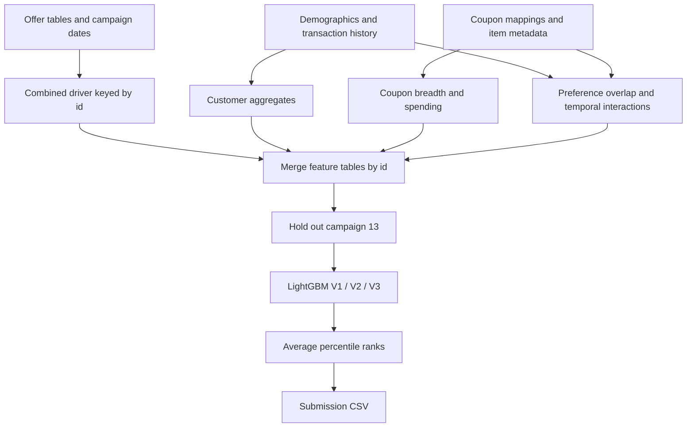

# [AmExpert 2019 — Coupon Redemption Prediction](https://www.analyticsvidhya.com/datahack/contest/amexpert-2019-machine-learning-hackathon/)

Final rank / teams / medal: not documented in the portfolio's root README or this solution's surviving records.

I built this solution around relational features and a small LightGBM ensemble.
The central question was whether a customer's purchase history matched the items
covered by a coupon, alongside their past response to discounts.

This event was hosted by Analytics Vidhya and American Express, rather than Kaggle;
the title links to the official competition page.
This folder preserves the competition approach in an executable portfolio form.
It does not claim a reproduced leaderboard score.

## Problem

I predicted `redemption_status`: whether a customer would redeem a particular
coupon in a marketing campaign. Each prediction belongs to an `id` identifying
a customer–coupon–campaign offer.

The objective is binary classification, evaluated with ROC AUC.
I use continuous scores because the metric measures ordering across classes;
there is no threshold selection step in this implementation.

The difficult part is assembling the evidence. A coupon can cover many items,
customers have very different purchase histories, and redemption is uncommon.
Campaigns also introduce a time boundary that a random row split would ignore.

## Data

The inputs are relational CSV tables, with no images, text encoders, or pretrained weights.
I join them through customer, campaign, coupon, and item identifiers.

| File | Schema / role |
| --- | --- |
| `train.csv` | `id`, `campaign_id`, `coupon_id`, `customer_id`, binary `redemption_status` |
| `test.csv` | The same offer identifiers, without the target |
| `campaign_data.csv` | `campaign_id`, `campaign_type`, `start_date`, `end_date` |
| `customer_demographics.csv` | `customer_id`, `age_range`, `marital_status`, `rented`, `family_size`, `no_of_children`, `income_bracket` |
| `customer_transaction_data.csv` | `date`, `customer_id`, `item_id`, `quantity`, `selling_price`, `other_discount`, `coupon_discount` |
| `item_data.csv` | `item_id`, `brand`, `brand_type`, `category` |
| `coupon_item_mapping.csv` | `coupon_id`, `item_id`; multiple items can belong to a coupon |
| `sample_submission.csv` | Optional reference layout: `id`, `redemption_status` |

Campaign dates use day/month/year strings; transaction dates use ISO dates.
Discount amounts retain their supplied signs, including negative reductions.
Demographic fields contain missing values and categorical ranges such as `5+`.
Some customers lack demographics or usable purchase history.

I retain these sparse offers through left joins instead of silently dropping them.
Missing profile values use a sentinel; absent transaction sums and similarities
use zero. Remaining missing merged features use a sentinel as well.

## Approach



### Validation and preprocessing

I hold out campaign `13` and train on the remaining labeled campaigns.
This tests transfer across campaigns while allowing customers to appear in both
partitions. It is a campaign holdout, not a guarantee of chronological isolation.
The CLI exposes the campaign ID so the split is explicit and repeatable.
Both partitions must contain both target classes for ROC AUC to be meaningful.

I standardize campaign dates and label-encode demographic categories.
The shared metadata tables are encoded once during feature construction, so
training and test offers receive consistent codes.
The existing campaign-duration fallback replaces a reversed end date with a
start date plus `90` days.

### Customer behavior and coupon coverage

I aggregate transaction counts, unique items, spending, discount totals, and
nonzero discount counts by customer, then join their demographic profile.
Brand and category diversity describe how broad their purchasing behavior is.
Additional transaction tables summarize quantity and spending at customer level.

For each coupon, I count eligible items, brands, categories, and brand types.
Joining transactions to eligible items gives coupon-level quantity, price, and
coupon-discount sums, means, and standard deviations.
These features distinguish broad offers from narrow offers and describe their
historical purchasing context.

### Preference matching and time features

I compute Jaccard overlap between customer purchases and coupon coverage at
item, brand, and category level. The customer side uses purchases with zero
coupon discount, retaining the original focus on purchases without coupon use.
An empty history produces zero overlap.

The temporal feature block filters transactions strictly before each campaign's
start. It summarizes quantity, spending, and coupon discounts for customers,
coupons, and customer–coupon pairs.
Customer totals come from the original transactions so that an item eligible for
multiple coupons does not multiply a customer's spending.

The other aggregate and similarity blocks use the entire supplied transaction
file. I preserve that behavior here, but it means this is not a fully time-isolated
backtest. Applying campaign cutoffs to every history-derived feature is a clear
next experiment before using this pipeline for prospective predictions.

### Models and training

I use the same engineered features with three LightGBM configurations:

| Model | Leaves | Maximum depth | Customer identity |
| --- | --- | --- | --- |
| V1 | 24 | 4 | Excluded |
| V2 | 48 | 6 | `customer_id` treated as categorical |
| V3 | 64 | 8 | `customer_id` treated as categorical |

The shared defaults use binary GBDT, learning rate `0.01`, row and feature
subsampling of `0.5`, and ROC AUC monitoring.
Training allows up to `2000` rounds with `200` rounds of early-stopping patience.
I save each model and report validation AUC and gain-based feature importance.
The dry run overrides training size and leaf constraints without changing these defaults.

The pipeline exports a combined labeled feature table as `full.csv`, but trains
with the campaign holdout retained. It does not perform an additional full-data refit.

### Ensemble and submission

I average each model's percentile ranks, matching predictions by `id` and retaining
test row order. Average ranks reduce sensitivity to differing prediction scales.
Percentile normalization preserves the ordering of the original rank blend and
keeps submitted scores in the unit interval.
These scores are not calibrated redemption probabilities.

Weighted arithmetic and geometric blends remain available as library helpers.
The default pipeline uses rank blending and writes `submission.csv` with exactly
`id` and `redemption_status`.

## What mattered most

The surviving code captures these design choices; it contains no reliable
ablation record, so I cannot assign a measured score gain to any one of them.

- Customer–coupon overlap makes the relevance of an offer explicit.
- Discount history separates general purchasing activity from coupon use.
- Campaign holdout validation exposes a different failure mode from random rows.
- Pre-campaign interactions add a temporal view alongside broad history aggregates.
- Varying tree capacity and customer identity gives the rank blend distinct inputs.

## Repository layout

```text
amexpert/
├── README.md                  # Solution narrative, scope, and run instructions
├── main.py                    # CLI for the complete pipeline or individual stages
├── example_usage.py           # Python API example running each stage in sequence
├── dry_run.py                 # Synthetic schemas, CPU training, and integrity checks
├── requirements.txt           # Runtime dependencies
├── .gitignore                 # Local data, generated outputs, and Python caches
└── src/
    ├── __init__.py            # Package marker
    ├── data_preprocessing.py  # Dates, category encoding, and campaign split
    ├── feature_engineering.py # Customer, coupon, overlap, and temporal features
    ├── modeling.py            # LightGBM configurations, training, and predictions
    ├── ensemble.py            # ID-aligned rank, weighted, and geometric blends
    └── pipeline.py            # Data preparation and stage orchestration
```

## How to run

### Real competition data

Use Python `3.11` and install the dependencies from this folder:

```bash
python -m pip install -r requirements.txt
```

Extract the competition files and arrange the CSVs directly under the input directory.
Rename downloaded files with archive suffixes to the names below if necessary.
No precomputed `driver.csv` or nested `data/data/` directory is required.

```text
data/
├── train.csv
├── test.csv
├── campaign_data.csv
├── customer_demographics.csv
├── customer_transaction_data.csv
├── item_data.csv
└── coupon_item_mapping.csv
```

```bash
python main.py --data-dir data --feature-dir data/feature \
  --model-dir data/model --score-dir data/score \
  --validation-campaign-id 13 --num-boost-round 2000 \
  --early-stopping-rounds 200 --num-threads 3 --step all
```

The result is `data/score/submission.csv`; individual model scores are alongside it.
Feature CSVs and cleaned campaign dates go to `data/feature`, and model files and
merged matrices go to `data/model`. Raw CSVs remain unchanged.

To resume a stage, use `--step preprocess`, `features`, `merge`, `train`, or `blend`.
Run prerequisite stages first and reuse the same directory and split arguments.
`python example_usage.py` demonstrates the same workflow with default paths.

### Synthetic dry run

```bash
python dry_run.py
```

This creates `sample_data/`, runs every feature family and all three models on CPU,
and writes `dry_run_output/score/submission.csv`.
It needs no competition download, GPU, or pretrained assets and skips no stages.
It checks row preservation, temporal sums, empty-history overlap, model reloads,
submission bounds, and ensemble alignment when prediction rows are shuffled.
Both generated directories are ignored locally. Rerunning replaces the sample files.
Synthetic validation metrics demonstrate execution only, not leaderboard performance.

## Lessons / what I'd do differently

- I would enforce campaign cutoffs consistently across all transaction features,
  then compare that backtest with the preserved competition feature strategy.
- I would evaluate several campaign holdouts before trusting customer identity
  features, particularly for customers absent from the training campaigns.
- I would retain ablations and experiment metadata alongside saved models so
  model diversity and individual feature gains could be demonstrated directly.
- I would cache shared transaction joins for larger runs; the current modular
  implementation rereads tables and can expand substantially at coupon-item joins.
