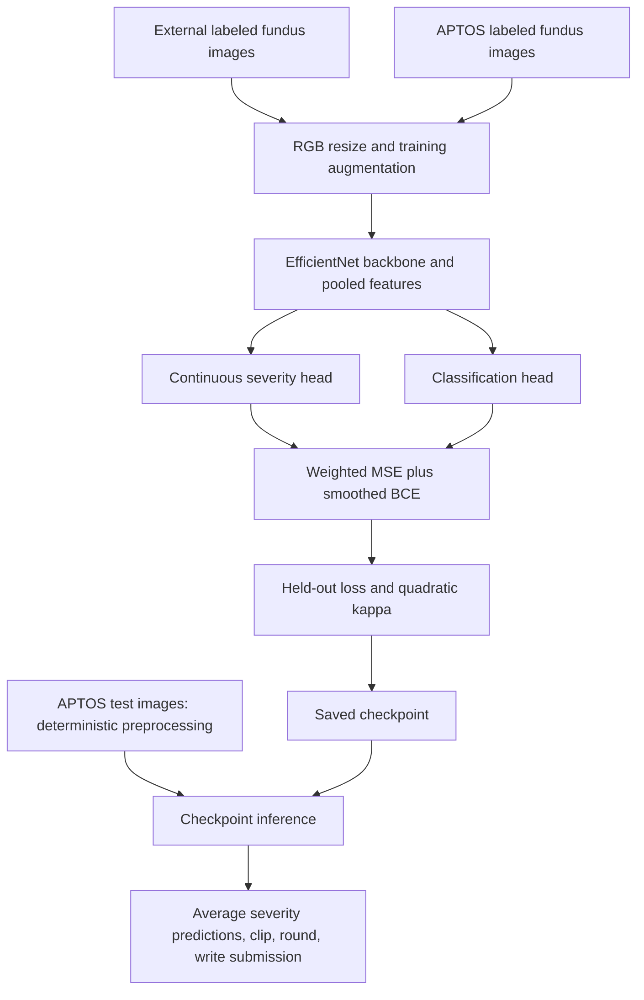

# [APTOS 2019 Blindness Detection](https://www.kaggle.com/competitions/aptos2019-blindness-detection)

**Final rank: 75 / 2,928 teams · Silver medal**

I built this solution around EfficientNet, ordinal severity prediction, and transfer
from an earlier retinal-image dataset. This folder preserves that approach and
provides a runnable version of the migrated training code.
The rank above is recorded in the portfolio's [competition table](../README.md).

## Problem

The task was to grade diabetic retinopathy from a retinal fundus photograph.
The target, `diagnosis`, is ordered:

| Label | Severity |
| --- | --- |
| 0 | No diabetic retinopathy |
| 1 | Mild |
| 2 | Moderate |
| 3 | Severe |
| 4 | Proliferative diabetic retinopathy |

The competition metric was **quadratic weighted kappa**. Predicting a distant
severity grade carries a greater penalty than confusing adjacent grades.
I therefore used both a continuous severity estimate and a classification head.
Subtle visual differences, image-quality variation, and an uneven class
frequency make this more demanding than ordinary object classification.

## Data

APTOS supplies RGB fundus photographs with variable dimensions and aspect ratios.
`train.csv` contains `id_code,diagnosis`; `test.csv` contains `id_code`.
Images are matched by identifier under `train_images/` and `test_images/`.
The submission has the same `id_code,diagnosis` columns as the training labels.

The original training recipe also uses labeled images from the earlier diabetic
retinopathy competition. Its local layout separates `pretrain/train/` and
`pretrain/test/`, with corresponding label CSVs. Here, “test” means the external
split **with supplied labels**, not the unlabeled APTOS competition test set.
The loader accepts native PNG images and the JPEG files used by the migrated code.

Black borders and differing camera framing affect how much of the retina is
visible after resizing. Label noise is another concern when adjacent grades have
similar appearances. I kept augmentation and small target perturbations in the
training recipe to address these sources of variation.

## Approach

### Validation

I use shuffled, stratified folds with seed `2017`: `10` folds for each external
label table and `5` for APTOS. Fold numbers start at `1`.
The splitter accepts native `id_code,diagnosis` and legacy `image,level` headers.

Each run holds out one fold. Validation uses deterministic resizing, padding,
and normalization, with no label noise, and includes every validation image.
The trainer reports kappa after clipping and rounding the regression output;
it saves the checkpoint with the lowest validation loss.
These are image-level splits. The code does not establish patient-level isolation
or detect duplicates across sources.

### Preprocessing and learned features

I resize nearly square images directly. For rectangular images, I preserve the
aspect ratio and pad/crop to a square input. Training adds horizontal and vertical
flips, brightness/contrast/saturation jitter, and random affine scaling.
Inputs are converted to RGB tensors and normalized with ImageNet statistics.

The configured resolution is `256 × 256` for pretraining and fine-tuning, then
`330 × 330` for combined training. Feature extraction is learned inside
EfficientNet; there is no separate handcrafted feature table or feature cache.

### Architecture and objective

The production default is ImageNet-pretrained **EfficientNet-B5**.
Its pooled features feed separate dropout/linear heads: a scalar severity output
and logits for the severity classes. The head width is derived from the selected
backbone, so smaller EfficientNet variants work with the same training code.



The main loss is `0.75 × MSE + 0.25 × smoothed BCE`.
Classification targets use the existing `0.9 × one_hot + 0.02` smoothing rule.
Gaussian label noise with scale `0.05` perturbs the training regression targets;
classification targets are rounded back to an integer grade.
The historically named `FocalBCELoss` implements smoothed BCE without focal modulation.

The optional paired-view mode draws independent augmentations of the same image.
It averages their predictions for the supervised loss and adds a `0.2`-weighted
consistency penalty between regression outputs and classification logits.
Enable it for combined training with `--noise-augmentation`.

### Training stages

- **Pretrain:** external labeled train/test images, `10` epochs by default.
- **Fine-tune:** APTOS images, `12` epochs; loads external `model_1.pt` when available,
  or the matching fold checkpoint if that file is absent.
- **Combine:** both external splits plus APTOS, `10` epochs at the larger resolution.
  APTOS examples receive loss weight `5.0`; external examples receive `1.0`.

The combined branch starts from ImageNet initialization in the preserved recipe;
it does not resume the fine-tuned checkpoint. Without an external checkpoint,
APTOS-only training starts from the configured ImageNet or random initialization.

I retain RAdam, weight decay, and StepLR scheduling. NVIDIA Apex O2 is optional on
CUDA; CPU and environments without Apex use full precision. There is no gradient
accumulation or weighted sampler: the dataset weights multiply per-image losses.

### Inference and scope of reproduction

The repaired inference entry point reloads checkpoints without downloading weights.
It averages continuous predictions if several checkpoints are supplied, clips them
to the valid severity range, rounds, and writes rows in test-CSV order.
No fitted thresholds or test-time augmentation are implemented here.

This is a reconstruction of the available training code, not a reproduction of the
original final submission. Original trained weights, a final ensemble manifest,
and reproducible competition validation logs are not included.
I do not claim that the synthetic check reproduces the competition score.

## What mattered most

These are the central choices in my solution; this folder does not contain
controlled ablations that quantify their individual score gains.

- An ordinal regression target expresses the distance between severity grades.
- External retinal-image pretraining provides a path from general image features
  to the visual patterns relevant to this task.
- Aspect-aware preprocessing keeps retinal framing consistent across photographs.
- Combined training gives APTOS labels more influence while retaining external data.
- Augmented views, target noise, and classification smoothing regularize training.

## Repository layout

```text
aptos/
├── README.md            # Solution narrative and execution guide
├── main.py              # CLI for folds, training stages, and prediction
├── dry_run.py           # Synthetic data, CPU training, and submission checks
├── example_usage.py     # Offline programmatic dataset/model/loss example
├── train.py             # Compatibility wrapper around the shared pipeline
├── requirements.txt     # Runtime dependencies; Apex is optional
├── .gitignore           # Local data, checkpoints, logs, and caches
└── src/
    ├── __init__.py      # Public package exports
    ├── config.py        # Paths, model defaults, and training settings
    ├── preprocess.py    # CSV normalization and stratified fold creation
    ├── data_utils.py    # PNG/JPEG loading, transforms, and paired-view datasets
    ├── model.py         # EfficientNet with regression/classification heads
    ├── loss.py          # Smoothed BCE, MSE, and view-consistency losses
    ├── optimizer.py     # Original RAdam implementation with current tensor APIs
    ├── trainer.py       # CPU/CUDA training, validation, and checkpoint metadata
    └── pipeline.py      # Stage orchestration and submission inference
```

`sample_data/` and `dry_run_output/` are generated locally and ignored by Git.
The notebooks mentioned by the earlier README are not present in this folder.

## How to run

### Environment and real data

Use Python 3.11 and install dependencies from this folder:

```bash
python -m pip install -r requirements.txt
```

Place downloaded competition data in this layout, or supply `--data-dir`:

```text
data/
├── train/
│   ├── train.csv                    # id_code,diagnosis
│   ├── test.csv                     # id_code
│   ├── sample_submission.csv        # id_code,diagnosis
│   ├── train_images/<id_code>.png
│   └── test_images/<id_code>.png
└── pretrain/                        # Required for pretrain/combine/all
    ├── trainLabels15.csv            # image,level or id_code,diagnosis
    ├── testLabels15.csv             # Must contain external labels
    ├── train/<id_code>.jpg
    └── test/<id_code>.jpg
```

`--train-dir` and `--pretrain-dir` override the individual directories.
The legacy APTOS layout `trainLabels19.csv` plus `train/` images is also accepted.
All default data and model paths stay inside this competition folder.
Pretrained training may download ImageNet weights; `--no-pretrained` disables it.

```bash
# APTOS-only route: external data is optional for these steps.
python main.py --step preprocess --data-dir ./data
python main.py --step train --data-dir ./data --fold 1

# Full recipe with the external labeled data, for one fold.
python main.py --step all --data-dir ./data --fold 1

# Predict using the saved combined model, or list several checkpoints to average.
python main.py --step predict --data-dir ./data \
  --checkpoints ./model/combine/model_1.pt --submission ./model/submission.csv
```

Omit `--fold` to train all configured folds. Individual `pretrain` and `combine`
steps expect fold CSVs from `preprocess`. Use `--device cpu --num-workers 0` for
CPU execution; full-size production training is substantially heavier than the smoke test.
Run `python main.py --help` for resolution, epoch, batch, and model options.

### Offline dry run

```bash
python dry_run.py
python example_usage.py
```

The dry run generates synthetic RGB images with native APTOS CSVs and PNG paths,
plus labeled external JPEG splits. It runs fold creation, learned CNN feature
extraction, pretraining, fine-tuning, combined training, paired-view training,
checkpoint reload, prediction averaging, and submission writing.
It uses random EfficientNet-B0, `64 × 64` inputs, and an epoch per training stage.

It checks deterministic validation, single-image output shapes, per-image losses,
finite checkpoints, and submission IDs/grades. A guard rejects pretrained downloads.
The output is `dry_run_output/submission.csv`. No pipeline stage is skipped;
CUDA/Apex acceleration and full-data competition training are not exercised.

## Lessons / what I'd do differently

- I would audit duplicate images and patient relationships before trusting
  image-stratified validation across multiple sources.
- I would archive out-of-fold predictions, checkpoint metadata, and the exact
  ensemble manifest alongside every reported score.
- I would compare loss-based checkpoint selection with kappa-based selection and
  evaluate threshold calibration using held-out predictions only.
- I would keep a small offline end-to-end check from the start; it catches data,
  device, tensor-shape, and submission failures introduced during refactoring.
