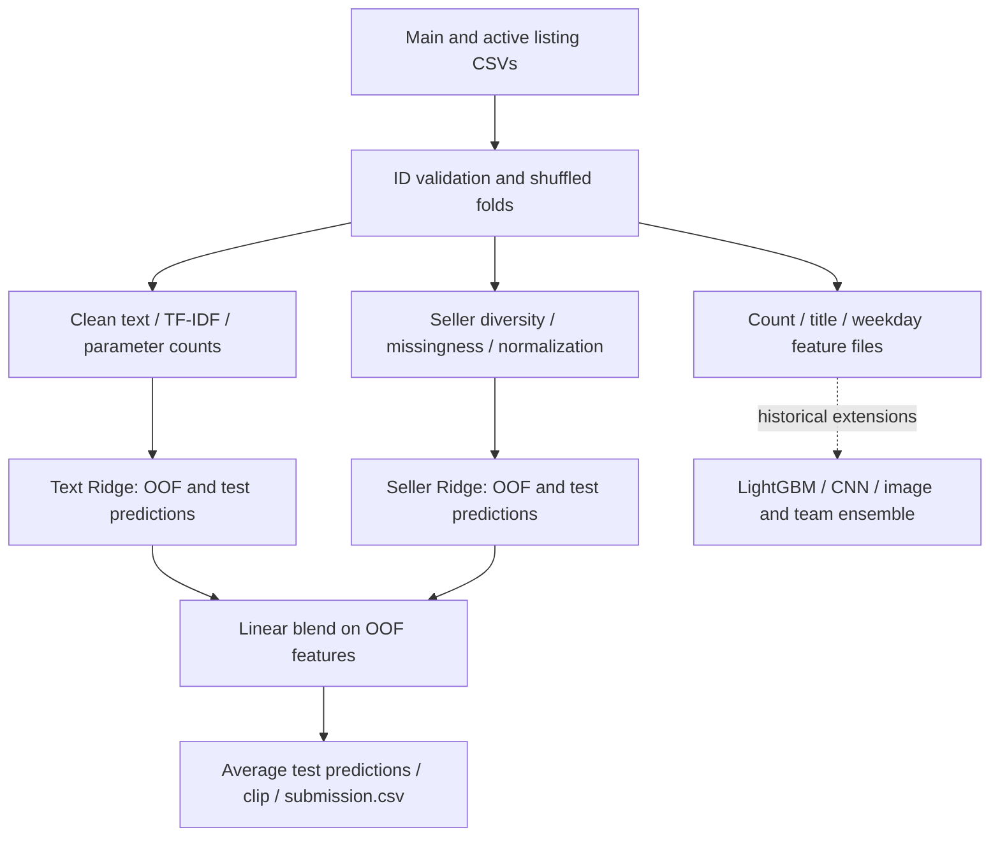

# [Avito Demand Prediction Challenge](https://www.kaggle.com/competitions/avito-demand-prediction-challenge)

**Final rank: 21 / 1,868 teams · Silver medal**

I’m Ujjwal Singh Rao, a Kaggle Master. My approach combined Russian listing
text, seller activity, structured attributes, and image signals in a staged ensemble.
Rank source: [portfolio competition table](../README.md).

This folder contains my historical competition scripts and a runnable, compact
TF-IDF/user-feature Ridge pipeline with a linear blend. The compact pipeline
explains and exercises part of the method; it does not reproduce the final team submission.

## Problem

I predicted `deal_probability`, a continuous target between zero and one for
an advertisement on Avito. The evaluation metric was root mean squared error (RMSE).

The difficulty was combining signals with very different representations:
free-form Russian text, sparse category combinations, seller history, and photographs.
Missing fields and repeated listings made both feature construction and validation important.

## Data

The main inputs are `train.csv` and `test.csv`, with one advertisement per row.
Training adds the `deal_probability` target; `item_id` identifies each prediction.

| Input fields | Representation and role |
| --- | --- |
| `title`, `description` | Russian text, with missing values, punctuation, and mixed alphabets |
| `param_1`, `param_2`, `param_3` | Category-dependent attributes; also concatenated as text |
| `region`, `city`, category names, `user_type` | Location and marketplace context |
| `user_id`, `item_seq_number` | Seller identity and listing sequence |
| `price`, `activation_date` | Numeric and temporal context |
| `image`, `image_top_1` | Photograph identifier and supplied image category |

`train_active.csv` and `test_active.csv` supply additional unlabeled listings.
I use them for seller diversity and category-frequency aggregates.
The runnable pipeline reads their listing attributes and titles, without requiring
`image_top_1`; image-category frequencies come from the main train/test tables.

The historical renewal scripts also use `periods_train.csv` and `periods_test.csv`.
The image branch expects extracted JPEGs, while the text CNNs expect fastText vectors.
Those files, fitted weights, and teammate prediction tables are not included here.

Repeated sellers and duplicate listing content can cross random folds.
Target-derived encodings need particular care: a global aggregate can reveal validation labels.

## Approach

### Validation and prediction bookkeeping

The runnable implementation uses shuffled K-fold splits: five folds by default,
with random state 2017. These are ordinary regression folds, not stratified folds.
Each base model writes one out-of-fold prediction per training item and averages
its fold predictions for the test items.

I align labels, feature rows, and predictions by `item_id`. Missing or duplicate
prediction IDs fail explicitly, and the submission follows the input test order.

The linear blender reuses these folds over the base out-of-fold predictions.
Its reported RMSE is a **stacking diagnostic**, not an independent nested-CV estimate:
base models that generated its training features can have seen its validation labels.
The vocabulary and unlabeled seller aggregates also use test covariates, following
the transductive competition approach.

### Preprocessing and text features

I lowercase and normalize title/description text while preserving Cyrillic letters,
separate digits, replace punctuation, and give missing text an explicit placeholder.
Russian stop words are filtered during TF-IDF vectorization.

The text Ridge model combines title and description unigram/bigram TF-IDF with
count-vectorized parameter strings. The description vocabulary is capped at 50,000
features; title vocabulary remains uncapped. Ridge uses alpha 20 by default.
Sparse matrices keep the text representation practical without pretrained downloads.

I also generate title statistics: word and character counts, punctuation, capitalization,
Russian-vowel presence, English characters, and stop-word counts.
Historical “positive/negative” word counts are target-associated lexicons, not a
pretrained sentiment model. They are generated for inspection, use global training
labels, and are **not consumed by the runnable models**. They need fold-local fitting
before they can safely become model inputs.

### Seller and structured features

Seller features count distinct titles, categories, and parameters, plus missing fields.
I cap these aggregates at their 70th percentile, standardize them, and fit a separate
Ridge model with alpha 0.00000001. Constant columns become zero instead of NaN.

The feature stage also writes category/city, seller, parameter-combination, and
image-category counts, plus activation weekday. These are retained feature outputs;
the compact Ridge blend consumes only text and seller features.

In the historical solution, relative price, renewal, duplicate, encoded-category,
item, and text-SVD features supported the larger tabular models.

### Model diversity and blending

The historical model tree contains sparse Ridge models, LightGBM variants, text CNNs
with fastText and categorical embeddings, and a VGG16 image branch.
Image predictions and teammate predictions were additional ensemble inputs.
Linear blending and a LightGBM stacker combined those signals at later levels.

The runnable path preserves the migrated text Ridge + seller Ridge + linear regression
blend. It clips final predictions to the valid probability interval and saves CSVs.
It does not serialize fitted estimators or provide an inference service for unseen listings.



## What mattered most

I built around these ideas; the archive does not contain a reliable ablation table,
so I do not attach numerical score gains to individual components.

- Sparse text models captured listing content directly and supplied useful stacking inputs.
- Active listings added seller context beyond the advertisement being scored.
- Relative price and category combinations represented marketplace context for tabular models.
- Text, tabular, and image models offered different views of the same listing.
- Out-of-fold predictions made the staged ensemble possible; ID alignment made it trustworthy.

## Repository layout

```text
avito/
├── README.md                  # Solution narrative, scope, and run instructions
├── main.py                    # CLI for the runnable pipeline stages
├── example_usage.py           # Programmatic pipeline example with configurable paths
├── dry_run.py                 # Synthetic CSV generation and end-to-end regression checks
├── requirements.txt           # Dependencies for the runnable Python 3.11+ pipeline
├── .gitignore                 # Local datasets, outputs, and Python caches
├── src/
│   ├── __init__.py            # Package marker
│   ├── config.py              # Model settings and configurable artifact paths
│   ├── data_utils.py          # CSV loading, folds, validation, ID-aligned joins
│   ├── feature_engineering.py # Text, count, seller, and weekday features
│   ├── models.py              # Sparse/user Ridge, OOF predictions, linear blend
│   └── pipeline.py            # Orchestration, evaluation, submission, feature inventory
├── features/                  # Historical feature scripts; not CLI dependencies
│   ├── count.py               # Categorical frequency aggregates
│   ├── date.py                # Activation weekday
│   ├── duplicate.py           # Duplicate listing signals
│   ├── encode.py              # Prediction-based categorical encodings
│   ├── item.py                # Listing/seller item aggregates
│   ├── relative.py            # Price relative to group averages
│   ├── renew.py               # Listing renewals from period tables
│   ├── svd.py                 # Low-dimensional sparse text decomposition
│   ├── text_desc.py           # Description statistics and word signals
│   ├── text_title.py          # Title statistics and word signals
│   └── user.py                # Seller aggregates and Ridge scores
└── model/                     # Historical multi-stage competition scripts
    ├── preprocess/
    │   ├── data_1.py          # First LightGBM feature matrix
    │   ├── data_2.py          # Second LightGBM feature matrix
    │   ├── data_3.py          # Third LightGBM feature matrix
    │   ├── data_4.py          # Neural text/category feature tables
    │   ├── data_5.py          # Image/category feature tables
    │   ├── fasttext.py        # Text corpus preparation for embeddings
    │   └── image.py           # Image resizing
    ├── level-1/
    │   ├── ridge_1.py         # Listing-text sparse Ridge
    │   ├── ridge_2.py         # Attribute-string sparse Ridge
    │   ├── image.py           # Image prediction blending
    │   └── weak.py            # External weak-model feature assembly
    ├── level-2/
    │   ├── model_1.py         # Categorical LightGBM training
    │   ├── model_2.py         # Alternative LightGBM training
    │   ├── model_3.py         # Expanded LightGBM training
    │   ├── model_4.py         # Text CNN and categorical embeddings
    │   ├── model_5.py         # Alternative text CNN
    │   ├── model_6.py         # VGG16 and categorical image model
    │   ├── score_1.py         # First LightGBM scoring
    │   ├── score_2.py         # Second LightGBM scoring
    │   ├── score_3.py         # Third LightGBM scoring
    │   ├── score_4.py         # First text CNN scoring
    │   ├── score_5.py         # Second text CNN scoring
    │   ├── score_6.py         # Image model scoring
    │   └── blend.py           # Intermediate prediction blend
    └── level-3/
        ├── blend.py           # Final linear blend with teammate predictions
        └── stack.py           # LightGBM stack with prediction summary features
```

## How to run

Install the compact pipeline dependencies from this folder:
```bash
python -m pip install -r requirements.txt
```

Place the competition CSVs in a directory with this layout:

```text
data/
├── train.csv                  # Listing schema plus deal_probability
├── test.csv                   # Listing schema without target
├── train_active.csv           # Additional unlabeled listing attributes and titles
└── test_active.csv            # Additional unlabeled listing attributes and titles
```

```bash
python main.py --data-dir ./data --output-dir ./output --step all
python main.py --help
python main.py --data-dir ./data --output-dir ./output --step evaluate
```

Individual stages are `preprocess`, `features`, `train`, `evaluate`, and `submission`.
Run preprocessing and features before training, and training before evaluation/submission.
Use the same paths, fold count, and random state across separate stage invocations.
`--features-dir` and `--model-dir` override their defaults under the output directory;
`--n-folds` and `--random-state` control the splits.
The model directory holds fold IDs and prediction CSVs, not saved fitted models.

For a standalone synthetic CPU run:

```bash
python dry_run.py
```

This creates schema-compatible Russian listing CSVs under `sample_data/`, runs the
compact pipeline, and writes `dry_run_output/submission.csv`.
It checks missing fields, constant aggregates, OOF coverage, shuffled feature rows,
submission ordering and bounds, and RMSE against aligned labels. No downloads are needed.
Images are intentionally missing in this sample, which is valid for the CSV pipeline.
Synthetic metrics are execution checks, not competition performance estimates.

The archived `features/` and `model/` scripts are source references, not supported
entry points: they retain historical paths/APIs and depend on external artifacts.
Their LightGBM, Keras/TensorFlow, OpenCV/Pillow, plotting, and optional MulticoreTSNE
runtime is separate from `requirements.txt`. The dry run does not exercise those branches
or reconstruct the full image/text-CNN/team ensemble.

## Lessons / what I'd do differently

- I would use a seller-aware or time-based holdout alongside random folds to assess generalization.
- I would nest the stacking validation and fit every target-derived feature within its training split.
- I would preserve fold manifests, embedding vocabularies, checkpoints, and teammate prediction provenance.
- I would keep measured ablations separate from feature inventories and historical leaderboard results.
