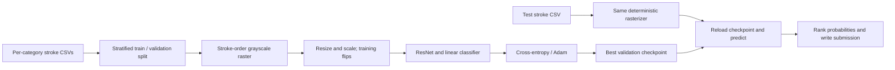

# [Quick, Draw! Doodle Recognition Challenge](https://www.kaggle.com/competitions/quickdraw-doodle-recognition)

**Final rank: #138 / 1,309 teams · Medal: not listed in the portfolio table.**

I approached sketch recognition by turning pen strokes into grayscale images
and fine-tuning a ResNet classifier. This folder preserves that raster-based
method and provides a runnable version of the migrated training pipeline.
The rank comes from the [portfolio README](../README.md); the synthetic run
below checks execution, not the historical leaderboard result.

## Problem

The task was to predict the object represented by a hand-drawn doodle across
340 categories. A submission ranks the most likely labels for each drawing.

The competition metric was **MAP@3**, which rewards a correct label more when
it appears earlier in the ranked predictions. The competition also required
underscores inside multiword labels. See the [official evaluation](https://www.kaggle.com/competitions/quickdraw-doodle-recognition/overview/evaluation).

Sketches are sparse and ambiguous: the same outline can suggest several objects,
and drawing styles vary substantially. The game-generated training drawings can
be incomplete or mislabeled, while the manually labeled test set has a different
distribution. That limits what an ordinary random holdout can tell me about
leaderboard performance. See the [competition description](https://www.kaggle.com/competitions/quickdraw-doodle-recognition).

## Data

I use the competition's **simplified stroke CSVs**, with a separate training file
for each category and a combined `test_simplified.csv` for prediction.

- Training columns include `key_id`, `drawing`, `word`, `recognized`,
  `countrycode`, and `timestamp`.
- Test inputs need `key_id` and `drawing`; additional metadata is ignored.
- `drawing` contains a serialized list of strokes. Each stroke holds parallel
  x-coordinate and y-coordinate lists.
- `word` is the training label, including spaces in multiword category names.
- I preserve `key_id` as text throughout loading and submission writing.

The model uses only the rendered strokes. It does not use country, timestamp,
or the game's `recognized` flag as features or filter training rows by that flag.
The stratified split preserves the observed class proportions rather than
rebalancing them. There is no user-group or duplicate-aware split in this code.

## Approach

### Validation and class mapping

I use a stratified shuffle split with a default training fraction of 0.9 and
random seed 2017. The category vocabulary comes from the actual `word` values,
is sorted once, and is saved alongside the prepared data.

The trainer derives its output size from that vocabulary. Checkpoints also store
the label order, architecture, and rendering size, so inference can detect a
mismatched label mapping and reuse the training resolution.

The retained trainer selects checkpoints using **top-3 accuracy**, expressed as a
percentage. This is an unweighted hit rate and is distinct from MAP@3.
I keep that original selection behavior explicit instead of presenting its logs
as competition scores. Losses and accuracy are aggregated by sample count.

### Stroke rendering and features

I rasterize every drawing onto a black 256 × 256 canvas with OpenCV.
Stroke width is 6 pixels. Earlier strokes are brighter; intensity follows
`255 - min(stroke_index, 10) * 13`. This gives the image a limited encoding of
stroke order while retaining its spatial geometry.

The canvas is resized to 64 × 64 by default and scaled into the unit interval.
Training adds a horizontal flip with probability 0.5; validation and inference
use deterministic rendering. Features are learned by the CNN rather than
computed as a separate tabular representation.

### Network and optimization

I expand the grayscale tensor across the RGB channels expected by ResNet.
The available backbones are ResNet18, ResNet34, and ResNet50; ResNet50 is the
default. Adaptive average pooling feeds a linear classifier over the vocabulary.

Production training initializes from ImageNet weights and fine-tunes the network
with cross-entropy and Adam. The defaults are learning rate 0.001, weight decay
`1e-4`, and 50 epochs. The code retains its unit-interval input scaling rather
than adding a new ImageNet normalization policy during this repair.

After 5 epochs without a better validation hit rate, I halve the learning rate.
Training stops if the rate falls below `1e-7`, or when the epoch budget ends.
The first validation result always produces a checkpoint, even if accuracy is zero.
CUDA and multiple GPUs are supported; CPU execution follows the same model path.



### Prediction and post-processing

I apply softmax to the saved model's logits, rank category probabilities, and
write `key_id,word` with the highest-ranked labels separated by spaces.
Spaces within a category become underscores. Input row order is retained.
Loading a trained checkpoint never requests pretrained weights.

This folder implements single-model prediction. The surviving code does not
contain an ensemble, test-time augmentation, mixed precision, or gradient
accumulation, so I do not claim those as parts of this implementation.

## What mattered most

The surviving files do not include controlled ablations. These are the central
ideas in the implementation, rather than claims of measured score gains:

- **Representation:** rasterization lets a conventional CNN learn sketch shapes.
- **Stroke order:** intensity carries a little temporal information into the image.
- **Transfer learning:** ImageNet initialization supplies the starting CNN features.
- **Validation discipline:** stratification and checkpointing support repeatable comparisons.
- **Submission integrity:** class order, intact IDs, and label formatting are part
  of the prediction pipeline, not incidental export details.

## Repository layout

```text
doodle/
├── README.md             # Solution narrative and runnable commands
├── main.py               # CLI for preprocessing, training, prediction, or all stages
├── example_usage.py      # Configurable programmatic pipeline example
├── dry_run.py            # Synthetic competition-schema data and CPU integration checks
├── requirements.txt      # Direct Python dependencies
├── .gitignore            # Local data, checkpoints, and cache exclusions
└── src/
    ├── __init__.py        # Public pipeline, dataset, trainer, and scorer exports
    ├── config.py          # Paths, training defaults, and offline initialization flag
    ├── data_utils.py      # Stroke rendering, augmentation, and data loaders
    ├── models.py          # ResNet classifiers and top-k accuracy
    ├── pipeline.py        # Vocabulary, stratified split, and stage orchestration
    ├── trainer.py         # Optimization, validation, scheduling, and checkpoints
    └── scorer.py          # Checkpoint loading, probabilities, and submission formatting
```

## How to run

Use Python 3.11 or newer, from this directory:

```bash
python -m pip install -r requirements.txt
```

### Real competition data

Download and extract the simplified competition files into this layout:

```text
data/
├── train_simplified/
│   ├── airplane.csv
│   ├── apple.csv
│   └── ... category CSVs
└── test_simplified.csv
```

Run the full pipeline with explicit paths:

```bash
python main.py --step all --model resnet50 \
  --source-data data/train_simplified --test-data data/test_simplified.csv \
  --data-dir data --epochs 50 --batch-size 32 --num-workers 0
```

Pretrained training may download torchvision's ImageNet weights on first use.
Use `--no-pretrained --device cpu` for random initialization without that download.
`--image-size`, `--lr`, `--train-ratio`, and `--seed` expose the relevant settings.
For programmatic use, construct `Config(data_path=...)` before creating the pipeline.

Preprocessing currently concatenates the selected CSV rows in memory. For a
bounded local experiment, set `--max-samples-per-class`; this reads a prefix of
each file, not a random sample. An unrestricted run requires enough RAM for the
selected dataset. The CPU demonstration below is the verified execution path;
full-data training and historical leaderboard reproduction have not been rerun.

Stages can also run separately against the same `--data-dir`:

```bash
python main.py --step preprocess --source-data data/train_simplified --data-dir data
python main.py --step train --model resnet18 --data-dir data --batch-size 32
python main.py --step predict --model resnet18 --data-dir data \
  --test-data data/test_simplified.csv
```

Prepared splits and `categories.pkl` are saved under `data/`.
Checkpoints and training logs go under `data/model/<model>/`.
The final submission is `data/submit/<model>_submission.csv`.
Keep the vocabulary and matching checkpoint together when moving artifacts.

### Synthetic dry run

```bash
python dry_run.py
```

This creates category CSVs, test data, and a sample submission under
`sample_data/`. It trains a randomly initialized ResNet18 for a single epoch
on CPU at reduced resolution, reloads the checkpoint, predicts, and writes
`dry_run_output/submit/resnet18_submission.csv`.

The run checks rendered tensor shape, disjoint splits, class coverage, ID
preservation, ranked-label formatting, and checkpoint creation. It blocks weight
downloads and skips no pipeline stages. Generated data and outputs are ignored.
The printed success message indicates a working pipeline, not model quality.

## Lessons / what I'd do differently

- I would select checkpoints with MAP@3 directly and retain top-3 accuracy as a
  diagnostic, so model selection matches the competition objective.
- I would examine near-duplicate drawings and validation distribution shift
  before treating a stronger random-holdout result as a leaderboard improvement.
- I would stream or shard the category files for full-scale training instead
  of materializing the entire selected dataset in memory.
- I would preserve experiment configs, ablations, and final checkpoint provenance
  alongside the source so historical performance claims are independently auditable.
