# [iMet Collection 2019 – FGVC6](https://www.kaggle.com/competitions/imet-2019-fgvc6)

**Final rank: 61 / 521 teams · Bronze medal**

I approached this as multi-label visual recognition: learn reusable image features,
then turn attribute probabilities into a short, recall-oriented set of tags.
This folder contains the migrated SE-ResNeXt training and inference pipeline.
The rank above comes from the portfolio's root README; this version includes an
offline smoke test, but does not reproduce the historical leaderboard result.

## Problem

Given a photograph of a museum object, predict its cultural and descriptive
attributes. An image can have several valid labels, so a single softmax class
would be the wrong output representation.

The metric is sample-averaged **F2**, with beta equal to 2.
Recall carries more weight than precision, making the probability threshold and
number of emitted labels part of the solution rather than a formatting detail.

The difficulty is the mix of visually diverse objects, subtle attributes and an
imbalanced label vocabulary. Common labels provide abundant supervision;
rare attributes are harder to learn and harder to represent in validation.

## Data

- Inputs are PNG images in `train/` and `test/`, loaded as RGB.
- `train.csv` contains `id` and `attribute_ids`; labels are space-separated
  integer ids, such as `0 2`. A zipped `train.csv.zip` is also supported.
- The model predicts **1,103 attributes** independently.
- `sample_submission.csv` supplies test ids and the `attribute_ids` output column.
  Its row order is preserved when writing predictions.
- `labels.csv` maps `attribute_id` to `attribute_name`. It is useful for interpreting
  predictions; the numeric training pipeline does not need it.

Images can have different dimensions. I crop or pad to a fixed training size,
then normalize channels using ImageNet statistics.
The loader fails clearly on missing or unreadable images instead of substituting
blank images and silently corrupting the experiment.

The original preprocessing expects an additional **`subset.csv`**, with columns
`intent`, `percent`, and `total`. This is an auxiliary solution artifact, not a
file generated by this repository. Its original contents and derivation are
not available here. When it is absent, preprocessing warns and keeps all labels.
I do not reconstruct its statistics from assumptions about the competition data.

## Approach

### Validation and label preparation

I count attributes, optionally apply the original long-tail filter, and represent
each image by its rarest remaining attribute for stratification.
The filter removes attributes with `percent <= 0.2` and `total <= 200`, plus
attributes with `total <= 20`. Images left without labels are excluded.

The default is 10 folds with `StratifiedKFold`, preserving input order within the
split procedure (`shuffle=False`). Fold ids are one-based and saved in `folds.csv`.
This is a proxy for multi-label stratification: it balances one representative
attribute per image, not every label combination. Very small strata can remain
uneven; use a suitable fold count for your dataset.

Filtering changes the evaluation population as well as the training labels.
Validation therefore measures the retained targets, which is a limitation when
comparing it with the original competition metric over all attributes.

### Image preprocessing and learned features

Training uses random horizontal flips, random crops with padding, and ImageNet
normalization. The default crop size is 300.
Validation and test inference retain the original random-crop behavior.
Each inference pass uses a single crop; there is no explicit multi-crop TTA loop.
For deterministic evaluation crops, set `val_transforms['random_crop'] = False`.

Features are learned inside the CNN. There is no separate tabular feature
extraction stage or external embedding cache.

```mermaid
flowchart LR
    A[RGB PNGs + attribute strings] --> B[Optional tail filter + stratified folds]
    B --> C[Crop / flip / normalize]
    C --> D[ImageNet SE-ResNeXt]
    D --> E[Adaptive pooling + dropout + linear head]
    E --> F[Frozen head training then full fine-tuning]
    F --> G[Per-fold test sigmoid probabilities]
    G --> H[Mean or weighted mean]
    H --> I[Threshold + top-k + nonempty fallback]
    I --> J[Submission in sample id order]
```



### Model architecture

The production options are SE-ResNeXt-50 and SE-ResNeXt-101 from
`pretrainedmodels`, exposed as `resnext50` and `resnext101`.
These retain grouped convolutions and squeeze-and-excitation blocks.
The default is the larger backbone with ImageNet initialization.

I replace fixed pooling with adaptive average pooling, add dropout at 0.3,
and attach a linear layer with an independent logit for every attribute.
Sigmoid converts those logits to probabilities during evaluation and inference.

### Training recipe

Training starts with a frozen backbone for one epoch, updating the classification
head. Batch-normalization statistics remain frozen during this stage.
The best head checkpoint initializes full-backbone fine-tuning.
Each stage writes its own checkpoint, including when the validation score is zero.

The trainer uses Adam, weight decay, cosine learning-rate scheduling and early
stopping. The default learning rate is `1e-4` for the head stage;
fine-tuning starts at one tenth of that value and runs for up to 20 epochs.
`--lr` controls the head-stage rate; `--epochs` controls the fine-tuning limit.

The active loss is sigmoid focal loss. Positive targets are smoothed to
`1 - epsilon`, and negative targets to `epsilon / 1000`, preserving the original
encoding. F2 evaluation converts these targets back to binary indicators.
BCE and a differentiable F2 loss are available through `ModelFactory`, but are
not additional stages in the default recipe.

### Ensembling and post-processing

Each trained fold predicts the **test images**. Validation scoring is a separate
API for inspection; validation ids cannot be used as submission predictions.
I average fold probabilities before converting them to attribute strings.
The weighted API normalizes nonnegative weights and aligns predictions by id.

The default decision rule keeps up to 10 labels above probability 0.2, and emits
the highest-probability label if none passes. Validation evaluates a threshold
grid, but the selected threshold is not automatically applied to submissions.
Set `Config.min_threshold` explicitly after reviewing validation results.

## What mattered most

These are the central decisions preserved in the code; no measured ablation
results are retained in this folder.

- ImageNet initialization supplied the visual feature extractor for diverse objects.
- Independent sigmoid outputs matched the multi-label target structure.
- Rare-label-aware folds made the long tail an explicit validation concern.
- Frozen-head initialization separated classifier fitting from backbone fine-tuning.
- Fold averaging and F2-aware label selection connected probabilities to the metric.

## Repository layout

```text
imet/
├── README.md               # Solution narrative and execution guide
├── requirements.txt        # Runtime dependencies
├── .gitignore              # Local generated-data and output exclusions
├── main.py                 # CLI for preprocess, train, predict, or all
├── example_usage.py        # Callable programmatic examples
├── dry_run.py              # Synthetic data, CPU training and output assertions
├── src/
│   ├── __init__.py         # Package marker
│   ├── config.py           # Paths, model settings and training defaults
│   ├── data_utils.py       # CSV loading, folds, image transforms and loaders
│   ├── models.py           # SE-ResNeXt, losses and checkpoint helpers
│   ├── trainer.py          # Two-stage training and sample-averaged F2
│   ├── scorer.py           # Validation/test inference and submission ensembles
│   └── pipeline.py         # Pipeline orchestration
└── tests/
    └── test_pipeline.py    # Regression checks for migration failures
```

## How to run

Use Python 3.11 and install dependencies from this directory:

```bash
python -m pip install -r requirements.txt
```

Place extracted competition data under a configurable directory:

```text
data/
├── train.csv               # Or train.csv.zip containing one CSV
├── sample_submission.csv   # id,attribute_ids
├── labels.csv              # Optional label descriptions
├── subset.csv              # Optional original tail-filter metadata
├── train/<id>.png          # Training images
└── test/<id>.png            # Test images
```

Run the complete recipe, or choose a single stage:

```bash
python main.py --step all --data-path ./data --output-path ./output \
  --model resnext101 --folds 10 --batch-size 20 --image-size 300
python main.py --step preprocess --data-path ./data
python main.py --step train --data-path ./data --fold-idx 1
python main.py --step predict --data-path ./data --fold-idx 1
```

Use matching model, fold count and output path across separate commands.
Training automatically creates folds if they are absent. If the fold count
changes, rerun preprocessing. Prediction requires every selected fold checkpoint;
`--fold-idx` selects just one. Production training downloads ImageNet weights on
first use; `--no-pretrained` disables that initialization. Checkpoint inference
never needs an ImageNet download. CUDA is selected when available, otherwise CPU.

Generated checkpoints, probability tables, logs and submissions go under
`output/`; the final file is `output/submissions/submission.csv`.

For a small, offline end-to-end check:

```bash
python dry_run.py
python -m unittest discover -s tests -v
python -m compileall -q .
```

The dry run creates 12 training PNGs and 3 test PNGs under `sample_data/`.
It uses a random SE-ResNeXt with one block per stage, 32-pixel crops, 2 folds,
and one epoch per training stage, entirely on CPU. It keeps the full attribute
output vocabulary and checks checkpoint reloads, validation scoring, test ids,
probability shapes, mean/weighted ensembles and submission label ranges.
No pipeline stage is skipped and no pretrained weights are downloaded.
Artifacts go under `dry_run_output/`; synthetic scores are not competition results.

## Lessons / what I'd do differently

- I would archive the exact split and auxiliary filtering metadata alongside the
  model artifacts so that later refactors can reproduce the training population.
- I would compare the rarest-label proxy with multi-label stratification and
  evaluate rare attributes before deciding whether filtering is worthwhile.
- I would use deterministic validation crops and persist threshold choices with
  checkpoints to make model selection and submission generation easier to audit.
- I would preserve out-of-fold predictions and measured ablations; the rank alone
  cannot establish how much each component contributed.
