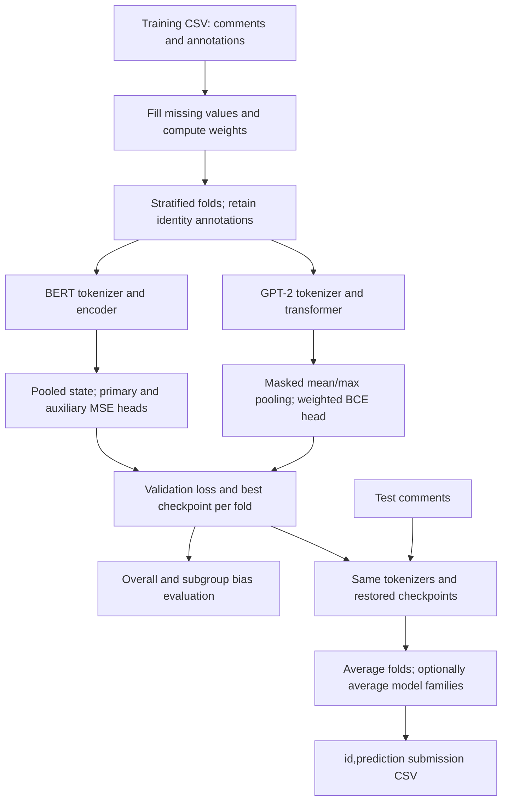

# [Jigsaw Unintended Bias in Toxicity Classification](https://www.kaggle.com/competitions/jigsaw-unintended-bias-in-toxicity-classification)

**Final rank: 146 / 3,165 teams · Silver medal**

I’m Ujjwal Singh Rao, a Kaggle Master. This folder preserves my bias-aware
comment classification approach: transformer representations, identity-based
sample weights, auxiliary toxicity supervision, and fold averaging.
The rank above comes from the [portfolio competition table](../README.md).
This is a runnable reconstruction of the retained code; it does not include
original competition checkpoints or a verified reproduction of the leaderboard score.

## Problem

I needed to predict whether a comment was toxic without treating an identity
mention as evidence of toxicity. A model could achieve a strong overall ranking
while still over-scoring ordinary discussion about a particular community.

The competition combines overall ROC AUC with identity-sensitive AUC measures.
For each identity, these assess discrimination within the subgroup and across
subgroup/background boundaries. The negative power mean emphasizes weak groups.
The implemented metric uses power `-5` and an overall AUC weight of `0.25`.
See the [competition evaluation](https://www.kaggle.com/competitions/jigsaw-unintended-bias-in-toxicity-classification/overview/evaluation).

I train on continuous annotation targets. Evaluation binarizes target and
identity annotations at `>= 0.5`, then computes AUC from continuous predictions.
This distinction matters for comments with mixed annotator judgments.

## Data

The inputs are CSV files containing English comment text and annotation scores.
The schema identifies this as the unintended-bias competition; the multilingual
and original multi-label Jigsaw competitions are separate portfolio entries.

| File / field | Role |
| --- | --- |
| `train.csv`: `id`, `comment_text` | Unique identifier and raw comment |
| `target` | Continuous toxicity target |
| `severe_toxicity`, `obscene`, `identity_attack`, `insult`, `threat` | Auxiliary targets |
| Identity columns | Annotation scores used for weights and bias evaluation |
| `test.csv`: `id`, `comment_text` | Unlabelled comments to score |
| `sample_submission.csv`: `id`, `prediction` | Competition output format; optional for this pipeline |

The configured identities are `male`, `female`, `homosexual_gay_or_lesbian`,
`christian`, `jewish`, `muslim`, `black`, `white`, and
`psychiatric_or_mental_illness`.

Missing identity annotations are treated as absent when building group masks.
Missing text becomes `none blank`; missing training targets become zero.
These are implementation conventions, not evidence that an unannotated identity
is absent. Label imbalance and uneven identity coverage make aggregate metrics
insufficient, so I retain identity columns through validation.

## Approach

### Validation and preprocessing

I use shuffled, seeded stratified cross-validation, with sample weight as the
stratum. The default is `5` folds. This preserves the distribution of weighted
training categories, but does not guarantee every identity has both classes in
every validation fold. Undefined subgroup AUCs are reported as `NaN`; they are
not silently converted into successful scores.

I keep text processing light and let each backbone’s tokenizer build its inputs.
The default maximum length is `222` tokens. Training and inference use the same
truncation, right padding, and explicit attention masks.
There is no separate tabular feature model: token representations are the features.

### Identity-based sample weights

Each comment starts at weight `1`. The retained weighting rule adds:

- A term when any configured identity score reaches the threshold.
- A term for toxic comments when any configured identity is below the threshold.
- A term for non-toxic comments when any configured identity reaches the threshold.

The second condition is deliberately described precisely: it is an **any-absent-
identity** test, not a test that all identities are absent. I preserve the code’s
weighting rule rather than silently replacing it with a different formulation.
These annotations affect training weights and evaluation; they are not model inputs.

### BERT with auxiliary supervision

The main branch fine-tunes `bert-base-uncased`. Its pooled representation passes
through dropout into a primary toxicity head and an auxiliary head.
The auxiliary head predicts `target` plus the other toxicity labels.

The retained objective is weighted mean squared error on the primary target,
scaled by `3.5`, plus mean squared error on the auxiliary outputs.
I retain the original sigmoid mapping at inference, which preserves score order.
Because the BERT objective is MSE, these outputs are not calibrated probabilities.

### GPT-2 as a complementary branch

The second branch fine-tunes `gpt2`. It concatenates mean and max pooling over
valid token states, then uses dropout and a binary classification head.
Padding is excluded from both pooling operations.

This branch uses weighted binary cross-entropy with logits. Its inference scores
come from a sigmoid. GPT-2 uses its own tokenizer and EOS-based padding;
BERT special tokens are never manually inserted into GPT inputs.



### Training and prediction

Both branches use AdamW, gradient accumulation, gradient clipping, and linear
warmup followed by linear decay. Optional mixed precision is enabled only on CUDA.
The default training duration is `3` epochs, with patience-based early stopping.
Checkpoint selection uses **validation loss**; bias metrics are reported separately.

I average predictions across folds. With `--model-type both`, the pipeline also
writes an equal average of the BERT and GPT-2 submissions. This is a transparent
combination supported by the current runner, not a claim about recovered final
competition ensemble weights. There is no leaderboard-tuned post-processing.

## What mattered most

These are the central choices visible in the retained solution. I do not have
saved ablations that would justify assigning a score gain to any individual one.

- Identity-aware weighting makes the bias objective influence optimization.
- Auxiliary toxicity labels give the BERT representation additional supervision.
- Subgroup, BPSN, and BNSP AUC expose errors hidden by overall AUC.
- Fold averaging reduces dependence on a single train/validation split.
- Consistent tokenization and padding keep training and inference aligned.

## Repository layout

```text
jigsaw/
├── README.md           # Solution narrative and reproducible commands
├── requirements.txt    # Runtime and offline tokenizer dependencies
├── main.py             # CLI for full runs and individual stages
├── example_usage.py    # Programmatic training and evaluation examples
├── dry_run.py          # Synthetic data, local tokenizers, CPU end-to-end check
├── test_regressions.py # Regression checks for masks, metrics, loss, and updates
├── .gitignore          # Excludes generated datasets, checkpoints, and caches
└── src/
    ├── __init__.py      # Public package exports
    ├── config.py        # Paths, backbone settings, and training configuration
    ├── data_utils.py    # Schema checks, sample weights, and persisted folds
    ├── models.py        # Model heads, datasets, losses, and training loops
    ├── evaluation.py    # Classification and identity-sensitive metrics
    └── pipeline.py      # Training, checkpoint restoration, and submissions
```

## How to run

Run these commands from this folder with Python 3.11 or newer:

```bash
python -m pip install -r requirements.txt
```

Download the [competition data](https://www.kaggle.com/competitions/jigsaw-unintended-bias-in-toxicity-classification/data)
after accepting Kaggle’s access terms. Place the extracted files here:

```text
data/
├── train.csv
├── test.csv
└── sample_submission.csv  # Optional reference template
```

The input directory must be writable: preprocessing also stores sample weights,
fold CSVs, and `test_processed.csv` there. Extra source columns are ignored.
Default output paths stay inside this competition folder.

```bash
python main.py --step full --model-type both \
  --data-path ./data --model-path ./model --output-path ./output
```

Production mode downloads the configured pretrained weights and tokenizers on
first use, or reads the local Hugging Face cache. CUDA is used when available;
otherwise the runner falls back to CPU. `--device cpu` explicitly selects CPU.

For separate stages, reuse the saved run configuration:

```bash
python main.py --step evaluate --model-type both --config ./model/config.json
python main.py --step predict --model-type both --config ./model/config.json
```

`--step process-data` and `--step train` are also available. CLI flags override
matching JSON settings. Use `python main.py --help` for paths and training options.
JSON supports nested `bert_config`, `gpt_config`, and `training_config` overrides.
The output directory contains `predictions/`, `evaluations/`, and `submissions/`.
Each submission has exactly `id,prediction`, in test-file order.

### Offline dry run

```bash
python dry_run.py
```

This creates `sample_data/` with `48` training comments and `5` test comments,
including missing text, missing annotations, and a threshold-boundary target.
It builds local WordPiece and byte-level BPE tokenizers and random-initialized
BERT/GPT-2 models with `2` layers and hidden size `32`.
Both branches train for `1` epoch over `2` folds on CPU with network access disabled.

The run covers preprocessing, token features, training, validation, checkpoint
reload, fold/model averaging, submission writing, and fresh-instance evaluation.
It asserts finite metrics and predictions, valid score ranges, and matching IDs.
No pipeline stages are skipped. Synthetic metrics are only a software check.

Generated artifacts go into `dry_run_output/`; both generated directories are ignored.
To exercise the CLI using the same offline configuration:

```bash
python main.py --step predict --model-type both --config dry_run_output/config.json
python -m unittest -q test_regressions
python -m compileall -q .
```

## Lessons / what I’d do differently

- I would archive out-of-fold predictions, exact environment versions, and the
  final blend alongside every competition run so the reported result is auditable.
- I would compare weight-stratified folds with splits that explicitly balance
  identity/target combinations and account for repeated comments.
- I would examine missing identity annotations separately and compare the retained
  weighting rule with alternatives using controlled ablations.
- I would study checkpoint selection by the bias metric alongside validation loss;
  auxiliary training loss is not a substitute for the competition objective.
