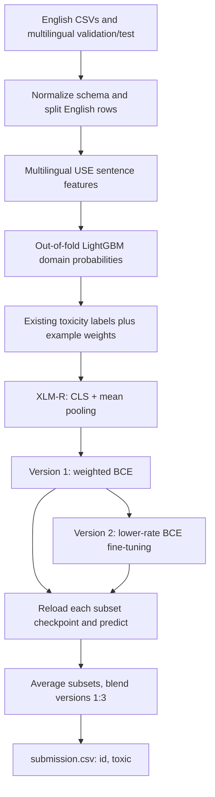

# [Jigsaw Multilingual Toxic Comment Classification](https://www.kaggle.com/competitions/jigsaw-multilingual-toxic-comment-classification)

**Final rank: #3 / 1,621 teams · Gold medal**

I built this solution for cross-language toxicity detection. This folder preserves
my refactored XLM-RoBERTa branch: sentence embeddings for domain weighting,
weighted training, lower-rate fine-tuning, and prediction blending.
The portfolio records the competition result above; this reconstruction is not
an exact reproduction of the complete medal-winning ensemble.

## Problem

I needed to assign a toxicity probability to each comment, learning primarily
from English annotations and predicting comments in other languages.
The competition metric was ROC-AUC, so ordering comments by toxicity mattered
more than choosing a classification threshold.
[Competition evaluation](https://www.kaggle.com/competitions/jigsaw-multilingual-toxic-comment-classification/overview/evaluation).

The difficult part was transfer: language, writing style, and annotation source
could all shift between training and evaluation. A good English validation score
alone would not establish multilingual performance.

## Data

The inputs are CSV files containing variable-length text, IDs, and toxicity
labels. There are no image or audio inputs.
The official English training files expose `comment_text` and `toxic`;
validation also supplies `lang`, while test uses `content` for the text.
[Competition data](https://www.kaggle.com/c/jigsaw-multilingual-toxic-comment-classification/data).

I normalize these into `id`, `source`, `lang`, `comment_text`, and, for labeled
rows, `toxic`. The first English dataset has binary labels; the unintended-bias
annotations can be fractional. The preserved preprocessing filters the latter
for positive toxicity/severity annotations, then thresholds toxicity at 0.5.
That filtering changes the class balance and deserves scrutiny when adapting
this code to a new dataset.

Optional English additions, labeled translations, subtitles, and translated
test views can be supplied separately. They are not included in this repository.
Domain scores are weights, not toxicity labels; unlabeled test comments never
become supervised training examples just because they receive a domain score.

## Approach

### Validation and training subsets

I keep a deterministic English holdout for the domain-weighting workflow and use
the competition's multilingual validation file for classifier checkpoint selection.
English text duplicates are removed before the English split; the train and
holdout rows are disjoint.

The retained classifier trains on disjoint shuffled subsets of rows whose source
is `2020-train`. `N_FOLDS=5` controls those ensemble partitions and the domain
classifier's cross-validation. The XLM-R subsets share a multilingual holdout:
this is not conventional out-of-fold XLM-R validation.
Optional augmentation weight files are generated, but the default classifier
source filter still selects the original English competition training rows.

### Preprocessing and features

I preserve text rather than aggressively stripping punctuation or normalizing
away language cues. Missing text becomes an empty string. For long comments,
tokenization retains the first 200 and last 50 words before applying the model's
300-token limit. XLM-R's tokenizer supplies token IDs and attention masks.

Separately, multilingual Universal Sentence Encoder produces 512-dimensional
sentence features. LightGBM predicts whether a sentence comes from the source
training pool or the validation/test pool. Out-of-fold domain probabilities
become per-example loss weights: target-like source comments receive more weight.

This is adversarial validation used for reweighting. The code does not generate
synthetic toxic comments or infer toxicity from the domain classifier.
The historical `pseudo/train_combine.csv` filename holds existing labels plus
weights, despite its name.

### Architecture and training

I use pretrained `xlm-roberta-large`, concatenate the CLS representation with
mean pooling over the sequence, apply dropout, and predict a single logit.
The sequence mean includes padded positions, matching the retained architecture.

Version 1 uses weighted binary cross-entropy, label perturbation, AdamW, gradient
accumulation, and gradient clipping. Version 2 loads the corresponding version-1
checkpoint and fine-tunes with ordinary binary cross-entropy at a lower rate.
Both stages use a validation-loss scheduler and select checkpoints by ROC-AUC.

The preserved defaults are batch size 8, five version-1 epochs at `1e-5`, and
four version-2 epochs at `1e-6`. Gradient accumulation spans four batches;
partial batches and the final incomplete accumulation group are processed.
CUDA is selected when available, with a CPU fallback. This folder contains the
PyTorch XLM-R branch; TPU and multilingual BERT are portfolio-level context,
not additional implemented trainers here.



### Ensembling and output

I average predictions across the English subsets within each version, then blend
version 1 and version 2 with weights 1:3. Predictions align by ID; repeated IDs
can represent translated views and are averaged before blending.
The repaired ensemble no longer duplicates a hard-coded prefix of the test file.
It checks that all prediction files cover the same IDs and contain probabilities.

## What mattered most

The retained code supports these priorities; it does not include ablation logs
that would justify attaching a score gain to any individual choice.

- I used a multilingual pretrained encoder to transfer English supervision.
- I used domain weighting to account for differences between source and target text.
- I separated weighted training from lower-rate refinement instead of changing the model head.
- I selected checkpoints on multilingual validation and blended independent subsets.
- I retained both the CLS representation and distributed sequence information.

## Repository layout

```text
jigsawml/
├── README.md                     # Solution narrative and reproducible commands
├── main.py                       # CLI for preparation, training, scoring, blending
├── dry_run.py                    # Synthetic data and offline CPU integration checks
├── example_usage.py              # Python API examples; offline demo when executed
├── requirements.txt              # Core PyTorch, NLP, tabular and LightGBM dependencies
├── requirements-use.txt          # Optional TensorFlow backend for production USE
├── setup.py                      # Package metadata and jigsawml console entry point
├── .gitignore                    # Generated datasets, checkpoints and build artifacts
└── src/
    ├── __init__.py               # Package marker
    ├── pipeline.py               # Preparation through final submission orchestration
    ├── data/
    │   ├── __init__.py           # Data API exports
    │   ├── data_preprocessing.py # CSV normalization, splits and domain-weight assembly
    │   ├── data_utils.py         # Tokenizers, datasets and data loaders
    │   └── embeddings.py         # Lazy optional USE loader and embedding tables
    ├── models/
    │   ├── __init__.py           # Model API exports
    │   ├── models.py             # XLM-R backbone, pooling and classifier head
    │   └── loss.py               # Weighted binary cross-entropy and reduction
    ├── training/
    │   ├── __init__.py           # Training API exports
    │   ├── trainer.py            # Training, validation and checkpoint serialization
    │   ├── inference.py          # Batched sigmoid predictions with preserved IDs
    │   └── scoring.py            # Reload and score each version/subset checkpoint
    └── utils/
        ├── __init__.py           # Utility API exports
        ├── config.py            # Paths, model settings and CPU/CUDA selection
        ├── adversarial.py       # LightGBM domain classification and example weights
        └── ensemble.py          # ID-aligned subset/version averaging
```

## How to run

Use Python 3.11 and install the core dependencies. Production sentence features
also need the optional USE backend and access to the pretrained model downloads.
TensorFlow and TensorFlow Text must have compatible wheels for your platform.

```bash
python -m pip install -r requirements.txt
python -m pip install -r requirements-use.txt  # production USE only
```

Place competition CSVs in this layout. Generated files remain under the chosen
data and model directories; paths no longer assume a Kaggle notebook mount.

```text
data/raw/
├── jigsaw-toxic-comment-train.csv   # id, comment_text, toxic; auxiliary labels allowed
├── jigsaw-unintended-bias-train.csv # id, comment_text, toxic, severe_toxicity
├── validation.csv                  # id, comment_text, lang, toxic
├── test.csv                        # id, content, lang
├── sample_submission.csv           # id, toxic; useful for checking output IDs
├── extra_english.csv               # optional: id, comment_text, toxic
├── train_foreign.csv               # optional: id, comment_text, lang, toxic
├── subtitle.csv                    # optional: id, comment_text, lang, toxic
└── test_english.csv                # optional translated views: id, comment_text
```

```bash
# Production pipeline; large pretrained models require substantial resources.
python main.py --mode full_pipeline --data_dir ./data --model_dir ./model

# Or run preparation stages, then train one subset in each stage.
python main.py --mode prepare_data --data_dir ./data
python main.py --mode embeddings --data_dir ./data
python main.py --mode adversarial --data_dir ./data
python main.py --mode train --version 1 --subset 0 --data_dir ./data
python main.py --mode train --version 2 --subset 0 --data_dir ./data
# Repeat training for every configured subset before scoring and blending.
python main.py --mode score --data_dir ./data --model_dir ./model
python main.py --mode ensemble --model_dir ./model
```

`--test_path` selects a custom test/translation file for scoring. `--device cpu`
forces CPU execution. Version 2 loads version 1 unless `--from_scratch` is passed.
`--load_pretrained` initializes version 1 from an existing local version-1
checkpoint; pretrained XLM-R initialization is already the production default.
`Config` exposes additional settings for Python callers.

```bash
python dry_run.py
```

The dry run writes competition-shaped CSVs under `sample_data/` and outputs under
`dry_run_output/`. It runs preprocessing, sentence-feature assembly, all domain
weighting branches, both training stages, checkpoint reloads, inference, and
submission blending on CPU. It checks splits, label/weight integrity, output IDs,
row counts, and probability bounds.

It uses a tiny random XLM-R configuration and a deterministic offline tokenizer.
Downloaded USE inference is replaced by deterministic 512-dimensional smoke-test
features; these are not semantic embeddings. No pretrained weights are downloaded.
This demonstrates execution and file contracts, not competition-level accuracy.
The final file is `dry_run_output/submission.csv`; production writes
`model/submission.csv` and the compatible `model/combined.csv` artifact.

## Lessons / what I'd do differently

- I would archive exact data provenance, translations, checkpoints and ensemble recipes alongside the code.
- I would report language-level validation and preserve ablations before claiming improvements from weighting or blending.
- I would revisit the source filter and padding-inclusive pooling through controlled experiments, rather than silently changing the retained method.
- I would keep a small offline integration run from the start: it catches missing files, leakage, discarded batches and checkpoint mix-ups early.
