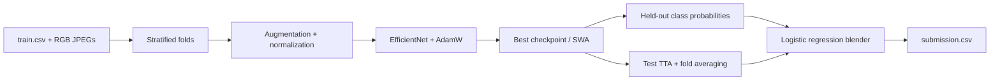

# [Cassava Leaf Disease Classification](https://www.kaggle.com/competitions/cassava-leaf-disease-classification)

Final rank / number of teams / medal: **not documented in the portfolio record**.

I built this solution around EfficientNet-B4, stratified validation,
stochastic weight averaging, and probability blending.
This folder is a runnable reconstruction of my competition code.
The portfolio identifies the method, but does not preserve a leaderboard score
or the individual experiment recipes behind every model version.

## Problem

I needed to identify the disease category of a cassava leaf from a photograph.
The task is single-label classification, evaluated by **accuracy**.
Each test image receives one integer label in the submission.

The challenge is separating disease symptoms from ordinary visual variation:
leaf orientation, lighting, background, and the amount of leaf visible.
Class imbalance also makes aggregate accuracy an incomplete diagnostic.
I used stratified validation and retained per-class reporting to inspect errors.

## Data

The pipeline reads the competition's RGB photographs from JPEG files.
`train.csv` associates an `image_id` filename with its integer `label`.
`sample_submission.csv` supplies the test image IDs and submission schema;
its label column is a placeholder, never a training target.

The class order is fixed throughout training, scoring, and blending:

| Label | Category |
|-------|----------|
| 0 | Cassava Bacterial Blight (CBB) |
| 1 | Cassava Brown Streak Disease (CBSD) |
| 2 | Cassava Green Mottle (CGM) |
| 3 | Cassava Mosaic Disease (CMD) |
| 4 | Healthy |

Images can have different source dimensions. The production model sees
normalized RGB tensors with shape `3 × 512 × 512`.
I preserve the original files and write fold assignments separately.
Preparation checks image IDs, labels, image availability, and class support
before creating the splits. It also prints class counts by fold.

This reconstruction does not perform label correction, duplicate detection,
or a merge with an external cassava dataset. The old paths referred to a
merged dataset, but its construction was missing from the recovered code.

## Approach

### Validation first

I use shuffled, seeded **5-fold stratified cross-validation**.
Each image contributes a prediction from the model whose training split
excluded that image. These out-of-fold (OOF) probabilities feed the blender.
Test probabilities are averaged across all trained folds for each run label.

This is an image-level split. It does not guarantee separation by plant,
photographer, or location; those grouping fields are not supplied to this loader.

### Image preprocessing and augmentation

I pad and resize images before cropping. At the production crop size,
the intermediate canvas follows the original `600 × 800` dimensions.
Smaller smoke-test configurations scale that canvas with the crop size.

Training uses random resized crops, transpose, flips, quarter turns,
affine changes, brightness/contrast, hue/saturation, and coarse dropout.
Validation uses a center crop. Both paths use ImageNet normalization.
The missing augmentation module was reconstructed from the documented recipe;
its exact historical augmentation probabilities were not available.

The implementation uses the current Albumentations interfaces.
Coarse dropout covers the role of the removed Cutout transform.
Image features are learned by the CNN; there is no separate handcrafted
feature extraction stage.

### EfficientNet and optimization

My production backbone is `tf_efficientnet_b4_ns`, initialized with pretrained
weights, with a linear classifier for the disease categories.
The alternative `CassavaClassifier` retains the recovered dropout/MLP head
for experiments; the main pipeline uses the direct classifier.

The defaults retain AdamW, cross-entropy, a learning rate of `1e-4`,
weight decay of `1e-6`, batch size `6`, and `20` epochs.
Gradients accumulate across `4` batches, with the final partial group included.
A cosine schedule with warm restarts controls the initial training phase.
Focal loss and label smoothing remain available as optional loss modules.

I keep the checkpoint with the best validation accuracy.
Early stopping can be enabled with `--patience`; the default runs the full schedule.
The default device is CUDA when available, otherwise CPU.

### Stochastic weight averaging and inference

SWA begins at zero-based epoch index `7` and uses its own learning-rate schedule.
After averaging weights, I refresh batch-normalization statistics using the
training loader and evaluate the averaged model on the validation split.
Scoring selects the better of the ordinary and SWA checkpoints for each fold.
Short runs that never reach SWA do not save an untrained averaged checkpoint.

Optional TTA averages probabilities over distinct rotations and mirrored views.
The default uses a single view; `--num_tta` enables additional views.
Checkpoint metadata records the backbone and image size, so inference can
rebuild the model without downloading pretrained weights again.

### Probability blending

I concatenate class probabilities from each model run and fit
one-vs-rest logistic regression with `C=0.2`.
The blender joins rows by image ID and requires complete, matching ID sets.
Predicted labels are never used as merge keys.

I report held-out blend-fold accuracy, then fit a final blender on all OOF
features and predict the test rows. The final file contains only `image_id,label`.
These blend diagnostics are not a fully nested estimate: the underlying CNN
fold models overlap in their training data. I would use nested validation
or a separate holdout before making a strong claim about blending gains.

The recovered `version0` through `version7` names are output labels, not
preserved distinct hyperparameter recipes. Repeating identical settings does
not provide useful ensemble diversity. The CLI defaults to `version7` alone;
multiple trained runs can be supplied to `--versions`.



## What mattered most

These are the design choices I retained; the archive does not contain
controlled ablations from which I can assign numerical score improvements.

- Pretrained EfficientNet features made transfer learning the core of the solution.
- Stratification kept disease classes represented in each validation fold.
- Spatial and color augmentation targeted variation in leaf photographs.
- SWA offered a second checkpoint candidate after the main optimization phase.
- Keeping OOF probabilities made blending possible without fitting to test labels.

## Repository layout

```text
leaf/
├── README.md                     # Solution narrative and runnable commands
├── main.py                       # CLI for preparation, training, scoring and blending
├── dry_run.py                    # Synthetic CPU smoke test and output assertions
├── example_usage.py              # Equivalent staged Python API example
├── requirements.txt              # Runtime and plotting dependencies
├── setup.py                      # Package metadata
├── .gitignore                    # Local data, models, logs and caches
└── src/
    ├── __init__.py               # Package marker
    ├── pipeline.py               # Fold training, OOF/test artifacts and submission
    ├── data/
    │   ├── __init__.py           # Data package marker
    │   ├── data_preprocessing.py # Schema checks, stratified folds and class counts
    │   └── data_utils.py         # RGB datasets, transforms and loaders
    ├── models/
    │   ├── __init__.py           # Model package marker
    │   ├── models.py             # EfficientNet and optional MLP classifier head
    │   └── loss.py               # Cross-entropy, focal and label-smoothed losses
    ├── training/
    │   ├── __init__.py           # Training package marker
    │   ├── trainer.py            # Accumulation, checkpoints, validation and SWA
    │   ├── inference.py          # Probability prediction and deterministic TTA
    │   └── scoring.py            # Accuracy, class reports and confusion matrix
    └── utils/
        ├── __init__.py           # Utility package marker
        ├── config.py            # Per-run configuration and production defaults
        └── ensemble.py          # OOF feature alignment and logistic blending
```

## How to run

Use Python 3.11 or newer and install the dependencies from this folder:

```bash
python -m pip install -r requirements.txt
```

Place the downloaded competition files under a chosen data directory:

```text
data/
├── train.csv                     # image_id,label
├── train_images/                 # JPEGs named by training image_id
├── test_images/                  # JPEGs named by test image_id
├── sample_submission.csv         # image_id,label; placeholder labels are ignored
└── label_num_to_disease_map.json  # Official mapping; optional for this loader
```

Run the complete production pipeline, or execute its stages separately:

```bash
python main.py --mode full_pipeline --data_dir ./data --output_dir ./output --versions version7

python main.py --mode prepare_data --data_dir ./data --output_dir ./output
# Repeat training for every configured fold before scoring:
for fold in 0 1 2 3 4; do
  python main.py --mode train --data_dir ./data --output_dir ./output --version version7 --fold "$fold"
done
python main.py --mode score --data_dir ./data --output_dir ./output --version version7
python main.py --mode ensemble --data_dir ./data --output_dir ./output --versions version7
```

Use the same fold count and data/output directories across staged commands.
`--test_path` accepts another CSV containing `image_id`; images still come from
`DATA_DIR/test_images`. `python main.py --help` lists the configuration flags.
Production training may download pretrained weights and is intended for a GPU.
`--device cpu --no-pretrained` enables local random-initialized experiments.

Outputs include `folds.csv`, `models/<version>/` checkpoints and logs,
`scores/<version>_oof.csv`, `scores/<version>_test.csv`, per-version submissions,
`blend/` fitted estimators, and the final `output/submission.csv`.
Input images and CSVs are not overwritten.

For a self-contained execution check:

```bash
python dry_run.py
```

The dry run writes `sample_data/` and `dry_run_output/` beside this script.
It uses `20` synthetic training images, `4` test images, `2` folds, a single
epoch, and random-initialized EfficientNet-B0 with `64 × 64` model inputs.
It exercises both run labels, accumulation, SWA, TTA, OOF alignment, blending,
and submission checks on CPU, without downloading weights. No stage is skipped.
The two run labels deliberately share a configuration to check file plumbing;
this is not a useful ensemble or a measure of disease-recognition quality.

## Lessons / what I'd do differently

- I would archive each model's exact configuration and OOF artifacts alongside its checkpoint.
- I would audit duplicate images and annotation disagreements before adding model capacity.
- I would test blending on a separate holdout and keep it only if it improves on fold averaging.
- I would keep this CPU smoke test with the solution so missing data modules and broken interfaces are caught during refactors.
