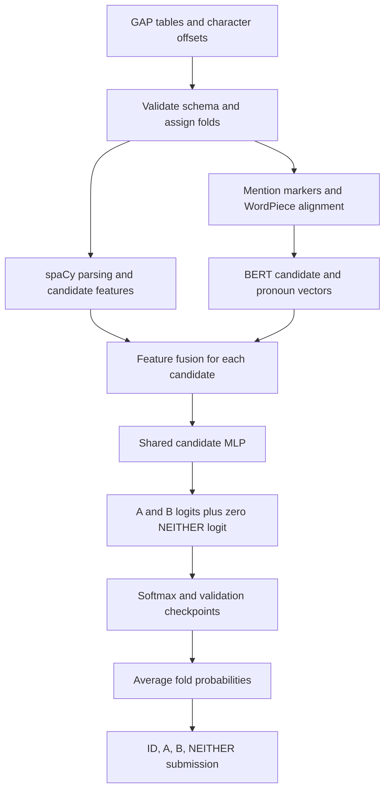

# [Gendered Pronoun Resolution](https://www.kaggle.com/competitions/gendered-pronoun-resolution)

**Final rank: 41 / 838 teams · Silver medal**

I’m Ujjwal Singh Rao. My solution combines BERT representations of a pronoun
and its candidate antecedents with explicit linguistic features.
The rank above comes from the [portfolio competition table](../README.md).
This folder contains the repaired training pipeline and an offline CPU smoke test;
it does not include the competition checkpoints or a reproduced leaderboard score.

## Problem

Given a passage, an ambiguous pronoun, and candidate names A and B, I predict
whether the pronoun refers to A, B, or neither. The submission contains a
probability for each outcome, evaluated with multiclass log loss.

For example, in “Alice thanked Beth because she helped,” proximity alone cannot
reliably identify the antecedent. Syntax, discourse context, and the topic of the
passage all matter. A plausible but overconfident wrong answer is costly under
log loss, so the model needs more than a hard candidate selection.

## Data

I work with GAP-style tab-separated tables: paragraph text, mention strings,
character offsets, and the source Wikipedia URL. The
[official GAP description](https://github.com/google-research-datasets/gap-coreference)
documents the schema and the dataset’s deliberate balance across genders.
That balance does not imply equal frequencies for the output classes.

| Columns | Meaning |
|---|---|
| `ID`, `Text` | Example identifier and unmodified passage |
| `Pronoun`, `Pronoun-offset` | Target pronoun and its character position |
| `A`, `A-offset`, `B`, `B-offset` | Candidate names and their positions |
| `A-coref`, `B-coref` | Boolean labels in training tables |
| `URL` | Source Wikipedia page, used for title matching |

If both coreference labels are false, the target is `NEITHER`.
Prediction tables may omit both label columns.
I validate the offsets against the original text before feature extraction.
Repeated names, multiword entities, punctuation, and WordPiece splitting make
this alignment a meaningful part of the pipeline.

The URL is a useful topic clue, but also a possible shortcut: it can favor the
article’s subject even when the local sentence points elsewhere.
Name-based gender heuristics and parser errors are additional sources of noise.
I treat those features as imperfect evidence rather than ground truth.

## Approach

### Validation

I concatenate the configured training and validation source files and assign
rows to folds by their position modulo `n_folds`. Each fold trains on the
remaining rows and chooses a checkpoint using its held-out cross-entropy.
The default is five folds.

This is the deterministic split implemented in the migrated code; it is not a
stratified or article-grouped split. The repair ensures that every fold,
including the first, has its own validation rows. The prediction source is
kept outside this training pool.

### Preprocessing and features

I insert temporary A, B, and pronoun markers at their exact character offsets,
working from right to left so earlier offsets remain valid. Mention text stays
in the passage. The tokenizer removes markers and records the corresponding
WordPiece positions before adding BERT’s special tokens.

For long passages, I crop context while retaining all target token positions.
If the span between targets cannot fit within `max_length`, the pipeline raises
an explicit error instead of gathering embeddings from the wrong positions.

spaCy supplies dependency trees, noun phrases, and named entities. Candidate
mentions are grouped by name, then filtered using syntactic constraints and
name-based gender agreement. For each of A and B, the classifier receives:

- A binned token distance, represented by a learned distance embedding.
- Wikipedia title/name overlap and a c-command-style structural indicator.
- Syntactic parallelism and grammatical-role prominence.
- Relative dependency/sentence distance and relative character distance.

The extractor also retains diagnostic features such as mention counts and
candidate counts. Those extra columns are not inputs to the current head.

### Model

I use `bert-large-uncased` by default, freeze its embeddings and first twelve
encoder layers, and fine-tune the remaining layers with the classification head.
The maintained implementation uses Transformers’ BERT API with the same
encoder and candidate-scoring design.

For each candidate, I concatenate its contextual vector, the pronoun vector,
their elementwise product, a distance embedding, and the remaining numeric
features. A shared MLP scores A and B separately; the `NEITHER` logit is fixed
at zero. A softmax turns these relative scores into the submission probabilities.



### Training and prediction

I retain AdaBound, weight decay, dropout, and BatchNorm from the original
implementation. The cosine scheduler supports decaying warm restarts and
advances by epoch. With the default short training schedule, it does not reach
its first restart.

Training uses cross-entropy and saves the lowest-validation-loss checkpoint
for each fold. There is no early-stopping callback or auxiliary-task loss.
For a singleton final batch, BatchNorm uses its running statistics so that the
example can still contribute a gradient.

At inference, I reload every fold checkpoint, average its probabilities, and
write `submission.csv` in input row order with the original IDs.
There is no additional calibration or rule-based probability override.

## What mattered most

These are the central design choices in the retained solution. I do not have
preserved ablation logs here to attribute a numerical score gain to each one.

- Contextual mention vectors let the model compare each candidate directly with the pronoun.
- Explicit syntax and distance features complement information learned by BERT.
- Shared candidate scoring applies the same decision rule to A and B.
- Freezing early encoder layers limits the number of parameters being fine-tuned.
- Averaging held-out fold models reduces dependence on a single fitted head.

## Repository layout

```text
pronoun/
├── README.md                  # Solution narrative and execution guide
├── config.yaml                # Production paths and hyperparameters
├── requirements.txt           # Runtime Python dependencies
├── setup.py                   # Package metadata and CLI entry point
├── main.py                    # Train/predict command-line interface
├── example_usage.py           # Programmatic training and prediction example
├── dry_run.py                 # Synthetic data and offline CPU integration check
├── .gitignore                 # Local data, checkpoints, and caches
├── src/
│   ├── __init__.py            # Package entry
│   ├── config.py              # Validated dataclass/YAML configuration
│   ├── data_utils.py          # GAP schema, mention alignment, and batching
│   ├── feature_engineering.py # Syntactic, positional, and URL features
│   ├── models.py              # BERT encoder and shared candidate scorer
│   ├── optimizer.py           # AdaBound and cosine scheduler
│   ├── trainer.py             # Optimization, validation, and checkpoints
│   └── pipeline.py            # Fold training and ensemble submission
├── tests/test_regressions.py  # Alignment, batching, and freezing regressions
├── sample_data/              # Generated synthetic TSVs and tiny model resources
└── dry_run_output/           # Generated smoke-test checkpoints and submission
```

## How to run

### Real data

Use Python 3.11 and run commands from this folder:

```bash
python -m pip install -r requirements.txt
python -m spacy download en_core_web_lg
```

Place GAP-schema files in the following layout, or edit the paths in
`config.yaml`. The filenames reflect the migrated solution’s defaults; the
`test_path` field selects the table to predict, regardless of its filename.

```text
data/
├── gap-test.tsv          # Labeled training source
├── gap-validation.tsv    # Labeled source pooled for cross-validation
└── gap-development.tsv   # Prediction source; labels are ignored if present
```

```bash
python main.py --config config.yaml --mode train --device cuda:0
python main.py --config config.yaml --mode predict --device cuda:0
```

Use `--device cpu` on machines without CUDA; unavailable CUDA also falls back
to CPU. Production BERT-Large remains expensive on CPU. Its tokenizer and
weights are downloaded on first use unless already cached, or
`model.pretrained_model` can point to a local Transformers model directory.
Set `data.spacy_model` to a locally installed spaCy pipeline when needed.

Training writes `outputs/fold_*/best_model.pth`; prediction writes
`outputs/submission.csv` with columns `ID,A,B,NEITHER`.
Use matching model, tokenizer, feature resources, and fold settings for both commands.
`example_usage.py` runs the same workflow using the default configuration.

### Offline dry run

```bash
python dry_run.py
```

I generate synthetic GAP tables under `sample_data/`, a local WordPiece
vocabulary, and randomly initialized spaCy parser/NER resources. BERT uses a
randomly initialized configuration with two layers and hidden width 32.
The run trains two folds for one epoch each on CPU, reloads the checkpoints,
averages predictions, and verifies the saved submission’s IDs and probabilities.
No model downloads or pretrained resources are required, and no pipeline stage
is skipped. The random linguistic and language models test execution only.

The generated `sample_data/dry_run_config.yaml` also works with the normal CLI.
All generated data and outputs are ignored by the local `.gitignore`.
To repeat the code checks:

```bash
python -m compileall -q .
python -m unittest discover -s tests -v
```

## Lessons / what I’d do differently

- I would group validation by article and audit duplicate passages to measure reliance on shared context.
- I would preserve out-of-fold probabilities and ablation logs alongside every submitted model.
- I would evaluate URL and gender-heuristic features separately for shortcut learning and uneven errors.
- I would keep offset-alignment checks and an offline smoke test beside the model from the start.
