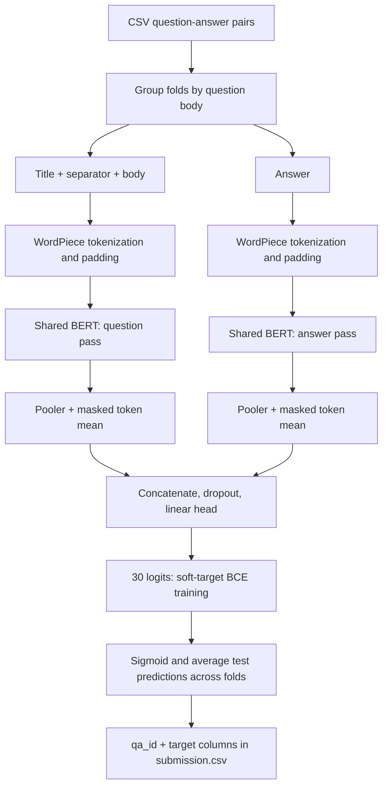

# [Google QUEST Q&A Labeling](https://www.kaggle.com/competitions/google-quest-challenge)

**Final rank: #21 / 1,571 teams · Silver medal**

I’m Ujjwal Singh Rao, a Kaggle Master. This folder preserves the BERT
question-and-answer modeling pipeline from my competition work.
The result above comes from the [portfolio competition table](../README.md).
That table lists BERT and RoBERTa; this runnable snapshot implements BERT.
It does not contain the full historical submission ensemble or its trained weights.

## Problem

I predicted how people would judge a question and its answer:
intent, clarity, usefulness, relevance, and related subjective qualities.
The output is a vector of 30 scores: 21 question attributes and 9 answer attributes.

The metric is mean column-wise Spearman correlation. Each attribute contributes
through the ordering of examples, so selecting checkpoints by ranking quality
matters even when the training objective is a pointwise loss.

The difficult part is that useful, interesting, and well written are different
judgments. A fluent answer can miss the question’s intent, and labels can contain
ties and disagreement. Long posts also compete for the encoder’s token budget.

## Data

The pipeline reads CSV files, with one question–answer pair per `qa_id`.
The expected schema is:

| Columns | Role |
| --- | --- |
| `qa_id` | Unique row identifier and submission key |
| `question_title`, `question_body` | Question text |
| `answer` | Answer text |
| `question_user_name`, `answer_user_name` | User metadata |
| `question_user_page`, `answer_user_page`, `url` | URL metadata |
| `category`, `host` | Topic and source metadata |
| Target columns in `src/config.py` | Training labels in submission order |

Targets are fractional scores in `[0, 1]`; I retain those values during training.
The code uses binary cross-entropy with soft targets, without thresholding them.
Metadata is retained in intermediate CSVs but is not fed into these BERT models.

Repeated question bodies can appear with different answers. Letting those rows
cross the validation boundary would expose the held-out question during training.
Rare question types and tied targets also make individual label correlations noisy.
Missing text is filled with an empty string before tokenization.

## Approach

### Validation first

I use `GroupKFold`, grouping by the exact `question_body`, with 5 folds by default.
This is grouped validation, not stratification or semantic duplicate detection.
Each fold starts with a fresh model and optimizer.

Validation predictions are joined by `qa_id` and restored to the original
`train.csv` order. They are never averaged across different held-out rows.
Test predictions, where every fold sees the same rows, are averaged across folds.

### Text preprocessing and representations

I lowercase text, replace newlines, and tokenize with BERT’s WordPiece tokenizer.
The question combines the title and body with a separator; the answer gets
its own token sequence. Both inputs receive special tokens, truncation, and padding.
The default maximum length is 512 tokens per input.

The original long-text fallback is retained: at 400 tokens, vocabulary-based
cleaning removes unsupported whole words and splits punctuation before retokenizing.
This is a lossy heuristic, so I would revisit it in a new experiment.
Padding is excluded from both attention and sequence-mean pooling.

### Model architecture

The default `QuestionUnderstandingModel` shares one pretrained `bert-base-uncased`
encoder between the question and answer passes. From each pass I take the pooler
output and mean token representation, then concatenate the four vectors.
Dropout and a linear head produce all target logits jointly.



`DualBERTModel` is the retained alternative: independent question and answer
encoders, pooled outputs, and a joint linear head. Its encoders are randomly
initialized from a BERT configuration, matching the implementation in this snapshot.
It is an experimental alternative, not a claim about the final competition blend.

### Training and inference

I fine-tune the default model with AdamW, learning rate `1e-5`, batch size 2,
and gradient accumulation over 4 batches. The default training budget is 6 epochs.
Accumulated gradients are normalized by the examples in each update window,
including the final partial window.

`ReduceLROnPlateau` monitors negative mean Spearman, and early stopping has
patience 3. The historical variable name `val_loss` therefore means negative
validation correlation; it is not validation binary cross-entropy.
Scoring handles ties deterministically. Constant target columns are omitted from
the local mean; constant predictions for varying targets contribute zero.

NVIDIA Apex remains optional for CUDA mixed precision. CPU runs use full precision.
Checkpoints contain weights, optimizer state, encoder configuration, and target order.
Inference reconstructs the model from the checkpoint without fetching backbone weights.
The tokenizer must still be available locally or through the configured model name.

The production prediction path averages sigmoid outputs equally across folds.
It does not fit blend weights or round predictions into label bins.
The optional `EnsembleModel` helper separately supports normalized weights over logits.

## What mattered most

These are the main design choices preserved here. I do not have retained ablation
logs that would support assigning a measured score gain to each one.

- **Question-group validation:** I keep repeated questions out of both sides of a split.
- **Separate text passes:** I give the question and answer their own token budgets.
- **Pooled and token-level features:** I combine the BERT pooler with broader text context.
- **Metric-based selection:** I select checkpoints using the ranking metric of interest.
- **Fold averaging:** I combine independently trained folds on the same test rows.

## Repository layout

```text
quest/
├── README.md             # Solution narrative and execution guide
├── main.py               # Train, evaluate, and inference CLI
├── dry_run.py            # Offline synthetic data and end-to-end checks
├── example_usage.py      # Commented Python API examples; no work on import
├── requirements.txt      # Required runtime dependencies; Apex is optional
├── setup.py              # Package metadata and CLI entry point
├── .gitignore            # Excludes data, weights, and generated smoke-test files
├── src/
│   ├── __init__.py        # Package marker
│   ├── config.py         # Model, training, paths, device, and JSON configuration
│   ├── data_utils.py     # Grouped splits, cleaning, tokenization, data loaders
│   ├── models.py         # Shared BERT, separate BERT, and weighted ensemble helper
│   ├── trainer.py        # Soft-target BCE training and checkpoint selection
│   ├── metrics.py        # Deterministic per-label and mean Spearman
│   ├── evaluator.py      # Reloading, held-out predictions, and submission writing
│   └── pipeline.py       # Fold orchestration, search, comparison, and inference
├── sample_data/          # Generated synthetic CSVs and local tokenizer; ignored
└── dry_run_output/       # Generated config, checkpoints, and submission; ignored
```

## How to run

### Real competition data

Use Python 3.11 and install the runtime dependencies:

```bash
python -m pip install -r requirements.txt
```

Download the [competition data](https://www.kaggle.com/competitions/google-quest-challenge/data)
separately and arrange it as follows. The pipeline generates `data/split/` itself.

```text
data/
├── train.csv              # Metadata, text, and all target columns
├── test.csv               # Same input columns, without targets
└── sample_submission.csv  # Competition reference for output schema
```

```bash
python main.py --mode train --data_path data --model_path models
python main.py --mode evaluate --data_path data --model_path models
python main.py --mode inference --data_path data --model_path models --output_path outputs
```

Training saves `models/config.json`. Evaluation and inference automatically load it,
or accept an explicit `--config path/to/config.json`.
CLI path arguments override config paths. JSON files may contain only the settings
you want to change, such as `batch_size`, `num_epochs`, `n_folds`, or `device`.

Use `--fold 1` to train a single fold. Evaluation and inference expect checkpoints
for every configured fold, so train the remaining folds before running those modes.
Use `--device cpu` to force CPU execution; the default selects CUDA when available.
The default pretrained BERT and tokenizer download on first use unless cached.
For local assets, set `model_name` to their directory and `local_files_only` to true.

Outputs include `models/fold_*/best_model.pt`, held-out predictions and labels under
`models/oof_predictions/`, and `outputs/submission.csv`.
Inference can run with only `test.csv` and the saved model/tokenizer assets.

### Offline dry run

```bash
python dry_run.py
```

This creates 10 training rows and 3 test rows using the real column names and
fractional target format. It uses a local WordPiece vocabulary and a random BERT
with 2 layers, hidden size 32, and sequence length 32.
The production default remains pretrained BERT; the smoke test sets `pretrained=False`
and supplies `bert_config` and `tokenizer_name` explicitly.

The script runs the actual CLI through grouped training, held-out evaluation,
checkpoint loading, test prediction, fold averaging, and submission writing.
It also checks the separate-encoder model, final accumulation updates, group
separation, row order, and finite predictions. All stages run on CPU, offline.
A passing run exits successfully and prints `PASS`; synthetic scores are not
competition results. CUDA/Apex and full-data leaderboard reproduction are untested.

## Lessons / what I'd do differently

- I would save fold assignments and ablation logs alongside every historical submission.
  That would make attribution of leaderboard gains much easier to audit.
- I would compare the vocabulary-cleaning fallback with explicit title/body token budgets;
  dropping unusual words can erase exactly the technical detail a quality judgment needs.
- I would study repeated-question consistency and per-label ties using held-out predictions
  before adding calibration or rounding to the ensemble.
