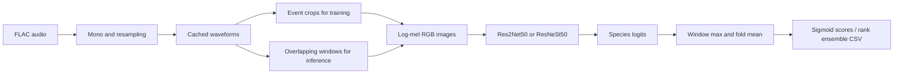

# [Rainforest Connection Species Audio Detection](https://www.kaggle.com/competitions/rfcx-species-audio-detection)

**Final rank: 78 / 1,143 teams · Bronze medal**

I approached species detection as image classification over short audio windows:
turn a call into a mel-spectrogram, learn its visual pattern, and scan each
recording for evidence of each species. This folder preserves that CNN pipeline
from my competition solution, with repairs for local execution on Python 3.11.
The placement above comes from the portfolio record; the migrated code does not
include the original checkpoints or a reproducible leaderboard score.

## Problem

The task was to identify which bird and frog species were audible in each
rainforest recording. Predictions were recording-level species scores; test
submissions did not require event timestamps.

The competition metric was **label-weighted label-ranking average precision
(LWLRAP)**: correct species should rank ahead of absent species, with each
positive label contributing equally. Multiple species can be present together.
See the [competition evaluation](https://www.kaggle.com/competitions/rfcx-species-audio-detection/overview).

The challenge was separating brief calls from background insects, overlapping
sounds, and changing recording conditions. An entire recording can contain much
more background than useful evidence for its annotated species.

## Data

I use the competition's FLAC recordings and event annotations:

- `train_tp.csv`: `recording_id`, `species_id`, `songtype_id`, `t_min`, `f_min`,
  `t_max`, and `f_max` for confirmed events.
- `train_fp.csv`: false-positive annotations supplied with the competition;
  this implementation does not consume them.
- `train/` and `test/`: audio files named `<recording_id>.flac`.
- `sample_submission.csv`: `recording_id` followed by `s0` through `s23`.

The [official data description](https://www.kaggle.com/competitions/rfcx-species-audio-detection/data)
explains the event schema. I retain its frequency and song-type fields when
preparing folds, but this model uses species labels and event times.

Audio is converted to mono and resampled to **32,000 Hz**. The default feature
representation uses **300 mel bins**, with **5-second** windows converted to
**300 × 300** images. The output contains **24 species** scores.

Annotations are event-level, and a recording can contribute multiple rows.
That makes recording identity a validation boundary. Species stratification
helps balance labels, but grouped splits cannot guarantee identical class
proportions. Treating other species as negative within an annotated crop is
also an approximation when calls overlap.

## Approach

### Validation

The migrated training loop uses **5 folds** and selects checkpoints by
**top-1 accuracy on annotated crops**. I keep that selection rule to preserve
the supplied training method; it is a proxy, not the competition's LWLRAP.

Fold preparation now uses stratified groups keyed by `recording_id`. All events
from the same recording stay together, fixing leakage possible with row-wise
splits. Existing fold files that split a recording across folds are rejected.
Validation uses deterministic center crops so the measurement does not change
simply because a different image crop was sampled.

### Audio and features

I cache resampled waveforms as NumPy arrays, then compute features in the
loader. For training, I center each audio window on the annotated event and
pad it if the recording is shorter than the requested window.

Librosa computes a mel power spectrogram and converts it to decibels. I
standardize the values, scale them to image intensities, and duplicate the
single spectrogram across RGB channels. This is channel replication, not a
color map. ImageNet normalization makes the result usable by the CNN backbone.



### Models and training

The `resnet` option uses **Res2Net50** (`res2net50_26w_4s`); `resnest` uses
**ResNeSt50** (`resnest50d`). Both replace the classification head with the
species output layer. Production training defaults to ImageNet initialization.

I train with binary cross-entropy on logits, Adam, and a ReduceLROnPlateau
scheduler. The default run uses **15 epochs**, a batch size of **8**, and a
learning rate of **1e-4**. Scheduler patience controls learning-rate reduction;
the supplied loop does not implement early stopping or mixed precision.

Training combines Gaussian audio noise, random image crops, coarse dropout,
brightness/contrast changes, and image noise. Mixup blends spectrogram tensors
and their labels, with the dominant sample's weight drawn from **0.8–1.0**.
This keeps the event-focused classifier exposed to combinations of sounds.

### Inference and ensembling

At inference I scan the complete recording using overlapping windows with
**75% overlap**. Each class keeps its maximum logit across windows, allowing a
brief call to contribute without averaging it away. The final window covers
the recording tail without repeatedly scoring an identical trailing segment.

I average fold logits and apply sigmoid to write bounded species scores.
Optional TTA repeats inference with the training augmentations. The full
pipeline writes both ordinary and TTA predictions before ensembling them.

The ensemble averages within-recording species ranks, normalized to a bounded
range. These are ranking scores, not calibrated probabilities. Prediction
files are aligned by recording ID and retain the sample submission's order.
The helper can also combine separately trained backbone outputs; a single CLI
invocation trains only the selected backbone.

## What mattered most

These are the central design choices preserved in the code. I do not have
saved ablations to assign a leaderboard gain to each one.

- **Crop around the event:** make the training example contain the annotated
  call instead of asking the model to find it in mostly background audio.
- **Reuse visual features:** log-mel images make pretrained CNNs useful for
  acoustic patterns without changing the classification architecture.
- **Mix audio evidence:** noise, image augmentation, and mixup expose the model
  to variations and combinations that occur in rainforest recordings.
- **Pool over time:** overlapping windows and per-species maxima connect an
  event classifier to a recording-level submission.
- **Combine predictions by rank:** fold averaging and optional rank fusion
  reduce reliance on one trained model or one augmented view.

## Repository layout

```text
rfcx/
├── README.md             # Solution narrative and execution guide
├── main.py               # Preprocess, train, predict, and full-run CLI
├── dry_run.py            # Synthetic FLAC fixture and CPU integration checks
├── example_usage.py      # Individually selectable Python API examples
├── requirements.txt      # Runtime dependencies
├── setup.py              # Package metadata and rfcx-train entry point
├── .gitignore            # Excludes generated audio, checkpoints, and caches
└── src/
    ├── __init__.py       # Package marker
    ├── config.py         # Independent audio/model/training/path settings
    ├── data_utils.py     # Mel features, augmentations, datasets, loaders
    ├── models.py         # Res2Net/ResNeSt factory and smoke-test override
    ├── trainer.py        # BCE training, crop validation, fold checkpoints
    ├── predictor.py      # Window pooling, fold inference, CSV output
    └── pipeline.py       # Seeds, grouped folds, resampling, rank fusion
```

## How to run

Use Python 3.11 and install `requirements.txt` in your environment:

```bash
python -m pip install -r requirements.txt
```

Download the competition data from Kaggle after accepting its rules. Expected
input layout, relative to this folder:

```text
data/
├── train_tp.csv
├── train_fp.csv          # Optional here; unused by this pipeline
├── sample_submission.csv
├── train/<recording_id>.flac
└── test/<recording_id>.flac
```

Prepare grouped folds and waveform caches, then train and generate predictions:

```bash
python main.py --mode preprocess --data-dir data --output-dir output --folds 5
python main.py --mode full --data-dir data --output-dir output \
  --model resnet --folds 5 --epochs 15 --tta --ensemble
```

Outputs include `output/positive.csv`, `output/resample/{train,test}/`,
`output/models/resnet/model_fold_*.pt`, and
`output/predictions/ensemble_predictions.csv`. Model families have separate
checkpoint directories. Use separate output directories for experiments with
different settings or backbone overrides.

`--mode train` and `--mode predict` run the corresponding stages independently.
Keep the model, fold count, audio settings, and image size consistent between
stages. Prediction loads local checkpoints without downloading pretrained
weights. Training downloads initialization weights unless `--no-pretrained`
is set. CUDA is used when available; `--device cpu --num-workers 0` selects
local CPU execution. Run `python main.py --help` for all path and size options.

For a small, self-contained integration run:

```bash
python dry_run.py
```

This generates schema-compatible, shortened synthetic FLAC recordings under
`sample_data/` and writes all results under `dry_run_output/`. It uses a random
MobileNetV3-small backbone, **64 × 64** features, **2 folds**, and **1 epoch** per
fold on CPU. All **24** output classes remain present; synthetic training calls
cover only a subset. No pretrained weights are downloaded.

The dry run exercises resampling, feature extraction, training, checkpoint
reload, ordinary/TTA inference, rank fusion, and submission validation. It also
checks short-audio padding, recording separation, and deterministic validation.
It proves pipeline execution, not real-data quality or the original placement.

## Lessons / what I'd do differently

- I would select checkpoints using recording-level LWLRAP and save out-of-fold
  predictions. Crop accuracy misses the competition's multilabel objective.
- I would investigate the supplied false-positive events and overlapping
  labels instead of treating every unannotated class as absent in each crop.
- I would retain experiment manifests, checkpoints, and ablations alongside
  the solution so each ensemble component's contribution is auditable.
