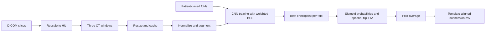

# [RSNA Intracranial Hemorrhage Detection](https://www.kaggle.com/competitions/rsna-intracranial-hemorrhage-detection)

**Final rank: 58 / 1,345 teams — Silver medal.**

I built a slice-level CT classifier around medical windowing, pretrained CNNs,
and patient-based validation. This folder preserves that approach in a runnable
pipeline, with a synthetic CPU example for inspecting the full data flow.
The competition result above comes from the portfolio's root README.

## Problem

I needed to predict whether a head CT slice contained an intracranial hemorrhage
and identify its subtype. This is multi-label classification: subtypes can coexist,
and the `any` target records whether any hemorrhage is present.

The evaluation uses weighted binary log loss, giving `any` twice the weight of
each subtype. Confident mistakes are expensive, so the submission contains
probabilities rather than thresholded decisions.

The difficult parts were subtle image contrast, unequal class frequencies,
and the similarity of neighboring slices from the same patient.
A random slice split can reward memorizing patient-specific features.

## Data

The inputs are grayscale CT slices stored as DICOM files.
Each file contains pixel data, rescaling metadata, and a patient identifier.
I convert stored values to Hounsfield units before applying windowing.

The training CSV has `ID,Label` columns, with one row per image and target:
`ID_000000000_any`, for example, refers to `ID_000000000.dcm`.
The sample submission uses the same long-format schema for test images.

There are six outputs, in this fixed internal order:

- `any`
- `epidural`
- `intraparenchymal`
- `intraventricular`
- `subarachnoid`
- `subdural`

The loader pivots labels by slice and retains `PatientID` for validation grouping.
Missing patient IDs or incomplete labels fail preprocessing explicitly.
Patient identifiers are not fed to the classifier.

## Approach

### Validation before model selection

I use patient-disjoint cross-validation to keep related slices together.
The restored preprocessing implementation uses `GroupKFold`, with five folds
by default. It saves the fold assignment alongside the labels in `train.csv`.

Each architecture and fold gets its own checkpoint directory.
Validation loads that fold's best checkpoint and evaluates its held-out patients.
The report includes weighted log loss plus class-wise threshold diagnostics;
log loss is the metric relevant to the competition.

The migrated folder was missing its entire data package. I reconstructed that
package from the documented windowing and patient-split design. These folds are
reproducible for a given input, but are not recovered historical fold assignments.

### CT preprocessing as feature construction

I rescale pixels with the DICOM slope and intercept, then build three channels
from the configured window centers and widths:

| Channel | Center | Width | Purpose |
|---|---:|---:|---|
| Brain window | 40 | 80 | Narrow brain-tissue contrast |
| Soft-tissue window | 80 | 200 | Broader soft-tissue contrast |
| Wide window | 40 | 380 | A wider view of CT intensity |

Each channel is clipped and scaled to the unit interval.
The windows are stacked, resized, and cached as compressed NumPy arrays.
The default CNN input is `3 × 512 × 512`.
ImageNet normalization is applied when loading a sample.

Training uses random resized crops with scale `(0.7, 1.0)` and horizontal flips.
Validation uses deterministic resizing. The CNN learns the remaining features;
there is no separate tabular feature model.

### CNNs and training

My primary architecture here is **SE-ResNeXt-101-32x4d**, initialized from ImageNet.
Adaptive average pooling feeds a linear head with six logits.
Sigmoid is applied for prediction, allowing independent subtype probabilities.

Alternative backbones are SE-ResNeXt-50, ResNet-50/101, Inception-v3, and EfficientNet-B2.
ResNet-18 is available for the lightweight CPU smoke test.
Missing architecture dependencies raise explicit errors.

I train with weighted BCE, RAdam, and StepLR.
The defaults are learning rate `1e-4`, weight decay `1e-5`, and three epochs.
StepLR reduces the rate by `0.1` every two epochs.
The trainer saves the best validation checkpoint and supports early stopping.
The training loss preserves the original weighted elementwise mean;
the reported competition metric normalizes by the sum of class weights.

NVIDIA Apex remains optional for CUDA mixed precision.
CPU runs use full precision, and CUDA training falls back to full precision
when Apex is unavailable. Inference loads checkpoints without downloading weights.

### Fold averaging and inference

I average probabilities across the folds for the selected architecture.
Optional TTA averages original and horizontally flipped images before fold averaging.
The CLI runs one architecture at a time; it does not automatically blend architectures.

Submission generation matches predictions to the supplied template by ID,
preserves its row order, and checks for missing, duplicate, or invalid predictions.
There is no additional thresholding or subtype-consistency post-processing.



## What mattered most

These are the central design choices I retained; this repository does not contain
saved ablation runs that would justify attaching a numerical gain to each one.

- **CT windowing:** expose useful intensity contrasts before asking the CNN to learn features.
- **Patient grouping:** keep related slices out of both sides of a validation split.
- **Pretrained CNN features:** adapt an image backbone to the stacked CT windows.
- **Metric-aligned weighting:** give the `any` output its intended importance during training.
- **Fold averaging:** combine separately trained models while retaining probability outputs.

## Repository layout

```text
rsna/
├── README.md                    # Solution narrative and run instructions
├── main.py                      # Shared CLI for each pipeline stage
├── dry_run.py                   # Synthetic DICOM generation and end-to-end assertions
├── example_usage.py             # Python API examples
├── requirements.txt             # Runtime dependencies; Apex remains optional
├── setup.py                     # Package metadata and console entry point
├── .gitignore                   # Local data, checkpoint, and smoke-test exclusions
└── src/
    ├── __init__.py              # Public API exports
    ├── core/
    │   ├── __init__.py          # Configuration exports
    │   └── config.py            # Settings, derived paths, and checkpoint locations
    ├── data/
    │   ├── __init__.py          # Data API exports
    │   ├── preprocessing.py     # CSV parsing, DICOM windows, and patient folds
    │   ├── data_utils.py        # Cached datasets, augmentation, and loaders
    │   └── data_analysis.py     # Class frequencies and fold counts
    ├── models/
    │   ├── __init__.py          # Model and loss exports
    │   ├── models.py            # CNN factory and pretrained/random-init control
    │   └── loss.py              # Weighted BCE and optional alternative losses
    ├── training/
    │   ├── __init__.py          # Training API exports
    │   ├── trainer.py           # Fold training, validation, and checkpoint saving
    │   └── optimizer.py         # Original RAdam and scheduler factories
    ├── inference/
    │   ├── __init__.py          # Prediction and validation exports
    │   ├── predictor.py         # Checkpoint loading, TTA, averaging, and submission
    │   └── validation.py        # Held-out predictions and metric reports
    └── pipeline/
        ├── __init__.py          # Pipeline export
        └── pipeline.py          # Preprocess → train → predict orchestration
```

## How to run

### Real competition data

Use Python 3.11 and install dependencies from this folder:
```bash
python -m pip install -r requirements.txt
```

Obtain the competition files through Kaggle and arrange them as follows:
```text
data/
├── stage_1_train.csv
├── stage_1_sample_submission.csv
├── train/
│   └── ID_<image>.dcm
└── test/
    └── ID_<image>.dcm
```

```bash
python main.py --mode full --data-dir ./data --output-dir ./output \
  --model resnext101 --device auto --epochs 3
python main.py --mode validate --data-dir ./data --output-dir ./output --model resnext101
python main.py --mode analyze --output-dir ./output
```

`auto` selects CUDA when available, otherwise CPU.
The production default may download ImageNet weights on first training.
Use `--no-pretrained` to disable that download explicitly.
Install NVIDIA Apex separately from its official repository only if using its CUDA path.

For differently named competition releases, pass `--train-labels`,
`--sample-submission`, `--train-images`, and `--test-images`, relative to `--data-dir`.
Use `--workers 0` for single-process loading or `--tta` for flip averaging.
`python main.py --help` lists all options and available architectures.

Individual `preprocess`, `train`, and `predict` modes are also supported.
Run preprocessing before training, or use `full --skip-preprocess` with an existing cache.
Keep fold count, image settings, and data paths consistent between stages.
The final file is `output/scores/submission.csv`; checkpoints live under
`output/models/<architecture>/fold_<fold>/best_model.pt`.

### Synthetic CPU dry run

```bash
python dry_run.py
```

This creates eight training and three test DICOM slices under `sample_data/`,
using the competition's `ID,Label` CSV schema and grayscale `512 × 512` pixels.
It uses random-init ResNet-18, `64 × 64` inputs, two patient folds, and one epoch.
It runs the actual CLI through preprocessing, training, validation, and prediction,
including checkpoint reload, flip TTA, and submission writing.

Assertions check patient separation, HU window values, updated model weights,
finite probabilities, and exact template ID order, including a singleton batch.
Outputs go to `dry_run_output/`; generated inputs and outputs are ignored by Git.
No pretrained weights are downloaded. No pipeline stage is skipped.
The dry run checks execution only; synthetic metrics do not reproduce the medal result.
GPU/Apex execution and full-data training are not covered by this CPU check.

## Lessons / what I'd do differently

- I would archive original fold manifests, configurations, checkpoints, and ablations
  together so that a later refactor can reproduce the exact competition experiment.
- I would preserve adjacent-slice context in a follow-up experiment; this implementation
  predicts each slice independently and leaves that information unused.
- I would inspect class balance within patient groups before changing the split strategy,
  and compare calibration and per-class errors using out-of-fold predictions.
- I would keep the synthetic test in the development loop: checkpoint collisions and
  submission-ID mistakes can invalidate an otherwise sound modeling approach.
