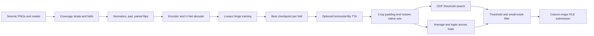

# [TGS Salt Identification Challenge](https://www.kaggle.com/competitions/tgs-salt-identification-challenge)

**Final rank: 292 / 3,219 teams · Bronze medal**

I approached salt identification as binary semantic segmentation: preserve the
small-scale seismic structure, learn a mask with a U-Net, and tune the final
mask decision against held-out images.

This folder is a runnable reconstruction of my migrated solution. The migration
retained the orchestration and configuration but omitted the data and model
modules. Those modules have been restored around the documented method.
The rank above comes from the portfolio's [competition table](../README.md);
I do not claim that this reconstruction reproduces the historical leaderboard score.

## Problem

The task was to identify salt deposits in seismic image patches.
These are subsurface seismic images, not aerial photographs.
For each test image I needed to submit a binary mask as a run-length encoded string.

The competition score averages per-image precision across IoU thresholds.
The evaluator implements thresholds from 0.50 through 0.95: a predicted mask
passes a threshold when its intersection-over-union exceeds that threshold.
An empty prediction on an empty target receives full credit.
This makes false positive salt on empty images especially costly.

Salt boundaries can be ambiguous, and foreground coverage varies considerably.
A model must recognize both broad regions and small deposits while preserving
boundaries in a low-resolution input.

## Data

- Inputs are **101 × 101** seismic PNGs, with approximately **4,000** training
  images documented in the original folder README.
- Training masks are paired PNGs; foreground pixels represent salt.
- `train.csv` contains `id` and `rle_mask`; training uses the paired PNG masks.
- `depths.csv` contains `id` and `z` for the images. I retain depth in the
  processed manifests; the current network consumes image pixels only.
- `sample_submission.csv`, when present, defines test ID order. Otherwise the
  pipeline derives that order from sorted test image filenames.

Empty masks and large differences in salt coverage make an unexamined random
split risky. Seismic textures and uncertain edges also make pixel accuracy a
poor guide to segmentation quality. I make no claim of exploiting a data leak.

## Approach

### Validation and preprocessing

I use coverage-based stratified cross-validation, with five folds by default.
The restored preprocessor distinguishes sparse masks, vertically uniform masks,
and increasing coverage bands. It records each image's coverage and fold.
Rare strata are pooled; if stratification is still impossible on a small input,
it explicitly warns and falls back to seeded K-fold splitting.

Images are converted to three channels for the pretrained encoder and normalized
with ImageNet statistics. The default path preserves the native image resolution
and reflect-pads to **128 × 128**, with **14** pixels before and **13** after
on each spatial axis. Masks receive zero padding.

I apply horizontal flips jointly to images and masks during training.
Validation and test loaders preserve their manifest order and use no random
augmentation. Coverage is a splitting feature, not an input to the network.



### Model and learned features

The default `seresnet34` model combines an ImageNet-pretrained ResNet34 encoder
with a U-Net decoder and spatial/channel squeeze-and-excitation attention.
Here, the name refers to SCSE in the decoder; the encoder is a standard ResNet34.
Skip connections carry spatial detail from encoder stages into the decoder.
Dropout regularizes the deepest features.

`resnet34` retains the same encoder without decoder attention.
`vgg11` provides the documented alternative encoder.
All variants return a single channel of logits at the padded input resolution.
There is no separate hand-crafted feature matrix: the encoder learns image features.

The restored decoder and coverage rules are implementation choices guided by the
surviving README, not recovered copies of the missing competition source.
Pretrained initialization uses torchvision's
[weights API](https://docs.pytorch.org/vision/stable/models/generated/torchvision.models.resnet34.html).

### Training

I keep Lovász hinge as the default loss to align training with overlap quality.
Its sorted-error formulation follows the
[authors' reference implementation](https://github.com/bermanmaxim/LovaszSoftmax).
BCE, BCE plus Dice, and focal loss are also available through `Config.LOSS_TYPE`.
Loss excludes padding; validation scoring uses native-size masks.

Training uses Adam, weight decay, learning-rate reduction after a validation
plateau, and early stopping. The first finite validation result can save a
checkpoint, including a zero score. Subsequent saves require improvement.

`--resume` reloads the best saved model and optimizer and continues at the next
epoch. It restarts patience counters; it is not an exact replay of an interrupted
run. The restored trainer uses ordinary full-precision updates.

### Inference and post-processing

I optionally average original and horizontally flipped predictions after
undoing the flip. Padding is removed before evaluation or submission.
If a smaller working image size was requested, logits are resized back to the
native mask dimensions before thresholding.

The evaluator selects a shared logit cutoff using out-of-fold predictions.
Test logits are averaged across all configured folds, then thresholded.
The default small-mask rule clears predictions containing at most **25** pixels;
the same rule is applied during evaluation.
RLE uses column-major traversal and one-based start positions.

Artifacts are separated by model name and by the tiny-model flag.
Submission requires every configured fold and rejects mismatched TTA settings,
changed checkpoints, or incompatible prediction shapes.

## What mattered most

These are the priorities preserved from the solution notes; I have no retained
ablation logs that justify assigning an individual score gain to each one.

- **Spatial detail:** U-Net skip connections preserve structure through downsampling.
- **Overlap-aware training:** Lovász hinge targets the kind of error that IoU measures.
- **Representative validation:** coverage strata expose empty-mask and dense-mask behavior.
- **Decision calibration:** native-size OOF scoring keeps threshold selection aligned
  with the masks actually submitted.
- **Prediction averaging:** fold ensembling and flip TTA combine complementary predictions.

## Repository layout

```text
salt/
├── README.md                    # Method, provenance, and running instructions
├── main.py                      # CLI for each pipeline stage
├── dry_run.py                   # Synthetic data and full CPU smoke run
├── example_usage.py             # Explicitly selected programmatic examples
├── requirements.txt             # Runtime dependencies
├── setup.py                     # Package metadata and CLI entry point
├── .gitignore                   # Excludes local datasets and run artifacts
├── tests/test_contracts.py       # Geometry, metrics, losses, checkpoints, backbones
└── src/
    ├── __init__.py              # Public pipeline/configuration exports
    ├── core/
    │   ├── __init__.py          # Configuration export
    │   └── config.py            # Defaults, validation, and configurable paths
    ├── data/
    │   ├── __init__.py          # Dataset/preprocessor exports
    │   ├── preprocessing.py     # Input validation and coverage folds
    │   └── data_utils.py        # PNG loading, transforms, and native-size restoration
    ├── models/
    │   ├── __init__.py          # Model/loss exports
    │   ├── models.py            # U-Net encoders, SCSE decoder, tiny smoke model
    │   └── loss.py              # Lovasz, Dice/BCE, focal, and competition metric
    ├── training/
    │   ├── __init__.py          # Trainer export
    │   └── trainer.py          # Optimization, validation, and checkpoints
    ├── inference/
    │   ├── __init__.py          # Predictor/evaluator exports
    │   ├── predictor.py        # TTA, ensemble, and submission serialization
    │   └── evaluator.py        # OOF scoring and threshold search
    └── pipeline/
        ├── __init__.py          # Pipeline export
        └── pipeline.py         # End-to-end orchestration
```

## How to run

Use Python **3.11** and install the dependencies from this folder:

```bash
python -m pip install -r requirements.txt
```

Extract competition files into the following layout. `--data-dir` points to
`data`, the parent of `download`; outputs default to this folder's `output/`.

```text
data/download/
├── train.csv
├── depths.csv
├── sample_submission.csv       # Optional: test IDs can be derived from PNGs
├── train/images/<id>.png
├── train/masks/<id>.png
└── test/images/<id>.png
```

Run preprocessing, all folds, prediction, OOF evaluation, and submission together:

```bash
python main.py --mode full --data-dir ./data --output-dir ./output \
  --model seresnet34 --epochs 200 --batch-size 32 --use-tta
```

The pretrained encoder may download ImageNet weights on its first training run.
Use `--no-pretrained` for random initialization, or `--device cpu` to force CPU.
`--mode preprocess`, `train`, `predict`, `evaluate`, and `submit` run individual stages.
`--fold` selects a fold only in training mode; prediction expects all folds.
Keep data, output, model, fold, image-size, and TTA settings consistent across stages.
Standalone `submit` uses the configured cutoff unless `--threshold` is supplied;
`full` automatically uses the selected OOF cutoff.

```bash
python dry_run.py
python -m unittest discover -s tests -v
python main.py --help
python example_usage.py model --tiny-model
```

The dry run writes **8** training and **3** test images with the real **101 × 101**
layout under `sample_data/`. It runs **2** folds for **1** epoch on CPU, resizing
working images to **25 × 25** and padding to **32 × 32**. A narrow random encoder
exercises the U-Net/SCSE path without downloading weights.
It covers every pipeline stage, including native-size evaluation and RLE checks;
no stage is skipped. Its scores measure execution only, not model quality.

The output is `dry_run_output/submit/seresnet34_tiny_submission.csv`.
Real runs write `output/submit/seresnet34_submission.csv`, along with processed
manifests, per-fold checkpoints, and validation/test logits.
Generated data and artifacts are ignored locally.

## Lessons / what I'd do differently

- I would preserve fold assignments, experiment logs, and the exact original model
  source alongside every competition submission; reconstruction leaves uncertainty.
- I would keep geometry and RLE checks close to inference: plausible-looking masks
  can still be serialized incorrectly.
- I would assess depth and correlated seismic structure explicitly when designing
  validation, rather than treating coverage balance as sufficient evidence.
- I would retain controlled ablations before attributing gains to attention or TTA.
