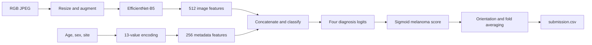

# [SIIM-ISIC Melanoma Classification](https://www.kaggle.com/competitions/siim-isic-melanoma-classification)

**Final rank: 6 / 3,308 teams · Gold medal** — Ujjwal Singh Rao, Kaggle Master.

I approached melanoma classification with EfficientNet image features, patient metadata,
and prediction averaging across folds and image orientations.
This folder preserves that modeling approach in a runnable training pipeline.
The rank above comes from the portfolio's root README; this refactored code is not an
exact reconstruction of the final competition ensemble, and no original checkpoints
or reproducible competition evaluation logs are included.

## Problem

The task was to assign a melanoma probability to each dermoscopic lesion image.
The submission contains an `image_name` and a continuous `target` score for every test image.
ROC-AUC measures how well the model ranks melanoma above non-melanoma cases.

The difficulty was distinguishing visually similar lesions under class imbalance.
Lighting, lesion scale, skin appearance, and image artifacts vary, while patient
metadata is incomplete. Multiple images can also belong to the same patient,
which makes the validation split an important modeling decision.

## Data

I use RGB JPEG images and the competition's tabular metadata:

- `image_name`: filename stem and submission identifier.
- `patient_id`: patient identifier; retained in metadata but not fed to the model.
- `sex`, `age_approx`, `anatom_site_general_challenge`: metadata features.
- `diagnosis`, `benign_malignant`, `target`: training annotations.

Images can have different source dimensions; the default pipeline resizes them to
512 × 512 and converts them to channel-first tensors.
Missing categorical values and unrecognized sites receive zero feature vectors.
Missing ages remain unknown rather than being assigned to the youngest age bin.

The classifier keeps the original four diagnosis groups: other, melanoma, nevus,
and keratosis. The binary `target` is authoritative for melanoma; unknown diagnoses
map to other, and keratosis variants map to the keratosis group.
Only the melanoma output is used for the competition submission.

The earlier write-up mentioned HAM10000, ISIC19, and other external data.
Their preparation scripts and datasets are absent here. This entry point reads one
training CSV and one test CSV; it does not automatically discover or merge external data.

## Approach

### Validation

I retain the five-fold stratified training scheme from the migrated implementation.
Folds are stratified by the mapped diagnosis classes when each class has enough rows;
otherwise the code falls back to the binary target. Each validation fold must have
both target classes so its ROC-AUC is defined.

A supplied `fold` column is respected. This lets me reuse a curated split without
silently replacing it. Generated folds are image-level, not patient-grouped, so
related patient images can cross folds. I would use patient-aware folds before
interpreting validation as an estimate of performance on unseen patients.

### Preprocessing and features

I round known ages into the existing age bins and one-hot encode age, sex, and site.
The resulting metadata vector has 13 elements: seven age bins, two sex categories,
and four anatomical-site categories. The encoding uses fixed lookup tables.

Training images receive random crops, horizontal and vertical flips, right-angle
rotations, and cutout-style coarse dropout, followed by ImageNet normalization.
Validation images use deterministic resizing and normalization.

Hair masking is optional through `--hair_mask_dir`. Masks are grayscale images
with white background and dark hair. No original masks are bundled, so the default
run leaves this augmentation disabled instead of applying the broken placeholder mask.

### Model

The default backbone is EfficientNet-B5 initialized with AdvProp pretrained weights.
I project its image representation to 512 features and the metadata to 256 features,
then concatenate them for a dropout-regularized classifier.



`MelanomaClassifierV2` retains the alternate metadata MLP and attention block from
the migrated code. Its attention operates on a single pooled image token; it is
not spatial attention over lesion patches. It is available through `--model_type v2`.

### Training

I train with AdamW and weighted binary cross-entropy over the one-hot diagnosis labels.
The positive-label weight is 4.0; this weights positive entries in all diagnosis
outputs, not just melanoma. Defaults are a batch size of 10 and a learning rate of 3e-5.

Gradients accumulate across two batches, including a shorter final accumulation window.
ReduceLROnPlateau follows validation melanoma AUC. Each fold saves its best checkpoint
and reloads that checkpoint before producing held-out or test predictions.
Training runs for the requested epochs; there is no early-stopping implementation.

NVIDIA Apex mixed precision is optional on CUDA. If Apex or CUDA is unavailable,
the same training loop runs in full precision. The portable dependency list does
not install the unrelated PyPI package named `apex`.

### Inference and ensembling

Test-time augmentation averages the original image, horizontal flip, vertical flip,
and both flips. I then average melanoma probabilities equally across fold models.
The CLI exposes this implemented behavior as `weighted_average`.

`src/ensemble.py` also contains AUC-weighted averaging, logistic-regression stacking,
a random-forest seed ensemble, and a calibration-set stacking helper.
These are separate utilities: learned stacking needs aligned held-out predictions
from multiple model families, which the single-family CLI does not manufacture.
The CLI writes `oof.csv` for inspecting held-out fold predictions.

## What mattered most

I would emphasize these design choices when explaining the solution. The surviving
code does not include ablations that establish their individual score gains.

- **Image representation:** EfficientNet supplies the visual features for lesion discrimination.
- **Metadata fusion:** age, sex, and site give the classifier context alongside the image.
- **Imbalance-aware training:** positive-label weighting changes the cost of missed positive labels.
- **Augmentation and TTA:** varied training views and averaged inference views reduce orientation dependence.
- **Fold averaging:** several fitted models contribute to the final ranking, rather than one checkpoint alone.

## Repository layout

```text
siim/
├── README.md             # Solution narrative, assumptions, and run instructions
├── main.py               # Training and submission CLI
├── dry_run.py            # Generate synthetic data and verify the complete CPU path
├── example_usage.py      # Explicit training, inference, and ensemble examples
├── requirements.txt      # Portable runtime dependencies
├── setup.py              # Package metadata and siim-train console entry point
├── .gitignore            # Local data, checkpoints, caches, and generated outputs
└── src/
    ├── __init__.py       # Python package marker
    ├── config.py         # Defaults and per-run configuration overrides
    ├── data_utils.py     # CSV schema, labels, metadata encoding, images, augmentation
    ├── models.py         # EfficientNet with metadata fusion; standard and V2 variants
    ├── loss.py           # Optional focal, smoothed BCE, and combined loss utilities
    ├── trainer.py        # Optimization, validation, best checkpoints, fold logs
    ├── inference.py      # Batched prediction, flip TTA, and checkpoint loading
    ├── ensemble.py       # Standalone averaging and stacking utilities
    └── pipeline.py       # Fold orchestration, held-out predictions, submission export
```

## How to run

Use Python 3.11 and install the dependencies from this folder:

```bash
python -m pip install -r requirements.txt
```

Download the competition CSVs and JPEG images from Kaggle and arrange them as follows.
If the download contains a `jpeg/` directory, place or link its `train/` and `test/`
directories under the chosen data directory. DICOM decoding is not part of this pipeline.

```text
data/
├── train.csv             # Metadata and training labels
├── test.csv              # Metadata without training labels
├── train/
│   └── <image_name>.jpg
└── test/
    └── <image_name>.jpg
```

Legacy `train_metadata.csv` / `test_metadata.csv` filenames and an `image_id` column
are also accepted. Metadata must include sex, age, and anatomical-site columns;
individual values may be missing. A training CSV needs `target` or `diagnosis`.

```bash
python main.py --data_dir data --model_dir models --score_dir scores --epochs 20
python main.py --help
```

Default training downloads pretrained weights if they are not cached and selects
CUDA when available, otherwise CPU. Full-resolution B5 training is intended for a GPU.
Use `--no-pretrained` for random initialization, `--device cpu` to force CPU,
`--no-use_tta` to disable TTA, and `--num_workers 0` for an in-process data loader.
Image size, backbone name, batch size, and fold count are CLI options as well.

Outputs are `models/melanoma_fold_<fold>.pt`, per-fold CSV training logs,
`scores/oof.csv`, and `scores/submission.csv`. Submission rows follow `test.csv` order.

For the small offline check:

```bash
python dry_run.py
```

It writes 24 synthetic training images and four test images under `sample_data/`,
using the competition column names and JPEG layout. It trains random-init
EfficientNet-B0 on CPU for one epoch in each of two folds at 32 × 32 resolution.
It exercises metadata features, training, validation, checkpoint reload, held-out
prediction, TTA, fold averaging, and submission export under `dry_run_output/`.
It checks row alignment, finite probabilities, and checkpoint prediction parity.
No pretrained weights are downloaded. CUDA/Apex and external hair-mask assets are
not exercised; no core pipeline stage is skipped. Synthetic AUC is not a competition result.

`python example_usage.py` runs a lightweight synthetic ensemble example.
Other examples are selected explicitly, such as `python example_usage.py basic`,
and require real data or previously trained default-model checkpoints.

## Lessons / what I'd do differently

- I would archive patient-aware fold assignments and duplicate-image checks alongside the models.
- I would keep external-data preparation, original ensemble weights, and evaluation logs together so the final result can be reconstructed.
- I would audit normalization against the pretrained weight recipe; this code retains the migrated ImageNet normalization with AdvProp weights.
- I would measure metadata, augmentation, and ensemble contributions with saved ablations before attaching numerical gains to them.
