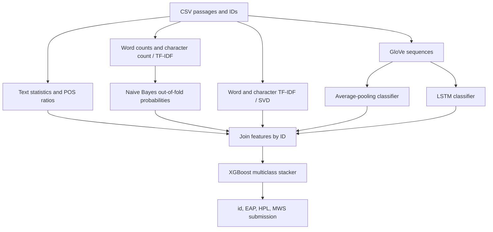

# [Spooky Author Identification](https://www.kaggle.com/competitions/spooky-author-identification)

Final rank: not documented / Teams: not documented / Medal: not documented in the portfolio table.

I approached author identification as a combination of writing style,
lexical patterns, and sentence meaning. This folder preserves that approach:
handcrafted text features, Naive Bayes, pooled GloVe embeddings, an LSTM,
and an XGBoost stacker.

The code is a repaired reconstruction of my competition pipeline.
The repository does not contain a verified leaderboard score or an ablation log;
I do not treat the old README's accuracy claims as measured results.

## Problem

Given a passage, predict its author: Edgar Allan Poe (`EAP`),
H. P. Lovecraft (`HPL`), or Mary Wollstonecraft Shelley (`MWS`).
The output is a probability for each author, not just a winning label.

The competition uses multiclass logarithmic loss: confident mistakes are costly.
That makes probability quality important throughout the stack.
See the [competition overview](https://www.kaggle.com/c/spooky-author-identification).

Short passages can share vocabulary, themes, and narrative conventions.
I wanted the model to distinguish an author's sentence construction and word
choices without relying only on obvious horror-related keywords.

## Data

The inputs are CSV files containing sentence-like excerpts from public-domain fiction.
The [data description](https://www.kaggle.com/c/spooky-author-identification/data)
notes that automated sentence splitting sometimes leaves unusual fragments.

| File | Required columns | Meaning |
| --- | --- | --- |
| `train.csv` | `id,text,author` | Labeled passages |
| `test.csv` | `id,text` | Passages to classify |
| `sample_submission.csv` | `id,EAP,HPL,MWS` | Competition output template |

IDs are identifiers, never predictive features. The loader preserves them as strings.
Missing text becomes an empty string; length ratios remain finite for empty
or punctuation-only passages. Unknown author labels and duplicate IDs fail early.

I do not assume balanced classes. The repaired pipeline uses stratified folds.
There is no source-book field in the expected schema, so random sentence folds
cannot establish how well the model generalizes to entirely unseen books.
No book lookup or external answer matching is part of this implementation.

## Approach

### Validation and stacking

I use five shuffled, stratified folds with a fixed seed by default.
Naive Bayes produces out-of-fold training probabilities and averages test
probabilities across folds. The repaired neural stages follow the same contract:
every training row receives a prediction from a model that excluded that row.
An inner holdout within each neural training fold controls early stopping.

This repairs the migrated code's shuffled, partial, in-sample neural outputs.
It is a reproducibility fix, not evidence of an original competition CV result.

XGBoost also runs cross-validation on the assembled feature table.
Its saved history is a **stacker diagnostic**, not an unbiased estimate of the
whole ensemble: base predictions are generated before that CV, rather than
rebuilt inside every outer split. A rigorous estimate would need nested stacking.

### Text statistics and linguistic features

I preserve raw punctuation and capitalization for stylistic features.
A lowercase, punctuation-stripped view supports word counts, unique-word counts,
average word length, stopword counts, and Porter-stemming counts.
NLTK adds noun, pronoun, determiner, adjective, and verb counts.
Ratios normalize these signals by passage length.

### Sparse lexical features

I train separate Multinomial Naive Bayes models on:

- Word counts with n-grams from 1 to 3 and English stopword removal.
- Character counts with n-grams from 1 to 7.
- Character TF-IDF with n-grams from 1 to 5.

Each representation contributes author probabilities to the final feature table.
Character features retain spelling fragments and punctuation patterns that a
word vocabulary can miss. Word and character TF-IDF also feed truncated SVD,
with 10 components per view by default and a smaller legal rank for tiny inputs.

The inherited approach fits vocabularies, IDF, SVD, and the neural tokenizer
on combined training and test text. This is transductive preprocessing:
no test labels are used, but it is not a strictly inductive evaluation.

### Embedding models

Both neural models start from trainable, 50-dimensional GloVe word embeddings
and sequences padded or truncated to 90 tokens.
The simple model averages embeddings before a softmax classifier.
The recurrent model uses an LSTM with 100 units, dropout, recurrent dropout,
and the same author softmax output.

I retain the staged learning-rate and batch-size schedule in `Config.NN_SCHEDULE`.
Training uses Adam and categorical cross-entropy, with early stopping on loss.
`--nn_epochs` replaces that schedule for a short run.
`--random_embeddings` is an explicit alternative for smoke testing without GloVe;
normal training still requires the local embedding file.

### Final combination



The stacker receives text statistics, SVD features, and base-model probabilities,
plus neural predicted classes, confidence, and agreement.
It uses shallow boosted trees, row and column subsampling, and regularization.
There is no additional weighted blend or probability post-processing.
The final fit uses the configured boosting-round count; CV is reported separately.

## What mattered most

I retained these as the central ideas of the solution. Without saved ablations,
I cannot honestly attach a score gain or rank these by measured improvement.

- Combining word and character representations gives the stack different lexical views.
- Length-normalized style features complement vocabulary-based classification.
- Pooling and recurrence provide different summaries of the same embeddings.
- Out-of-fold probabilities make base-model predictions usable as stacking inputs.
- ID alignment and a fixed author-column order are essential to a valid submission.

## Repository layout

```text
spooky/
├── README.md                  # Method, limitations, and run instructions
├── main.py                    # CLI for the full pipeline or individual stages
├── dry_run.py                 # Synthetic CSV generation and CPU smoke validation
├── example_usage.py           # Python API examples; defaults to the dry run
├── requirements.txt           # Libraries imported by the solution
├── setup.py                   # Package metadata and spooky-author CLI entry point
├── .gitignore                 # Excludes datasets, caches, models, and generated scores
└── src/
    ├── __init__.py            # Package marker
    ├── config.py              # Paths, author mapping, and training defaults
    ├── data_utils.py          # CSV validation and ID-checked feature assembly
    ├── feature_engineering.py # Style features, sparse n-grams, and SVD
    ├── models.py             # Naive Bayes, embedding models, and XGBoost
    └── pipeline.py           # Stage orchestration, CSV outputs, and model reload
```

## How to run

### Real competition data

Use Python 3.11 or newer, from this directory:

```bash
python -m pip install -r requirements.txt
python -m nltk.downloader -d ./nltk_data stopwords averaged_perceptron_tagger_eng
```

Unzip the competition CSVs and obtain the matching GloVe file separately:

```text
spooky/
├── data/
│   ├── train.csv
│   ├── test.csv
│   └── sample_submission.csv  # Reference template; not required by the loader
└── glove/
    └── glove.6B.50d.txt
```

```bash
python main.py --data_dir ./data --glove_path ./glove/glove.6B.50d.txt \
  --nltk_data_dir ./nltk_data --model_dir ./models --score_dir ./scores \
  --show_importance
```

The submission is `scores/xgb_score.csv`; `scores/xgb_cv.csv` contains the
stacker CV history. `models/xgb_model.json` is the final booster checkpoint.
Intermediate feature and probability CSVs are also written to `scores/`.
The neural fold models are not persisted; reproducing their scores requires training.

Use `--step text_features`, `naive_bayes`, `neural_network`, or `lstm` to regenerate
a stage. `--step xgboost` requires all preceding artifacts for the same dataset.
Use a fresh score directory after changing input text or configuration:
ID validation cannot detect a stale artifact with unchanged IDs.
`python main.py --help` lists paths and short-training overrides.

### Synthetic dry run

```bash
python dry_run.py
# Interpreter used for validation in this workspace:
/Users/ujjwal/Downloads/solo/kaggle/.venv/bin/python dry_run.py
```

The script writes invented passages with the competition schema under `sample_data/`.
It runs all stages on CPU using small random embeddings and a short neural fit.
No GloVe weights are downloaded. On first use it downloads small NLTK stopword
and English POS-tagger resources if unavailable; subsequent runs reuse them.
An offline first run needs those resources provisioned beforehand.

Outputs go under `dry_run_output/`. Checks cover submission column order,
ID order, finite probabilities summing to one, complete training-score rows,
CV history, and booster reloading. Empty and punctuation-only test passages
exercise preprocessing edge cases. Success prints `DRY RUN PASS` and exits normally.
This verifies execution, not competition performance.

## Lessons / what I'd do differently

- I would save fold assignments and use nested validation before comparing stack variants.
- I would test book-aware splits if source metadata were available, to separate style from topic overlap.
- I would preserve ablations, environment versions, and submission provenance alongside every result.
- I would persist tokenizers and neural checkpoints for standalone inference on new passages.
