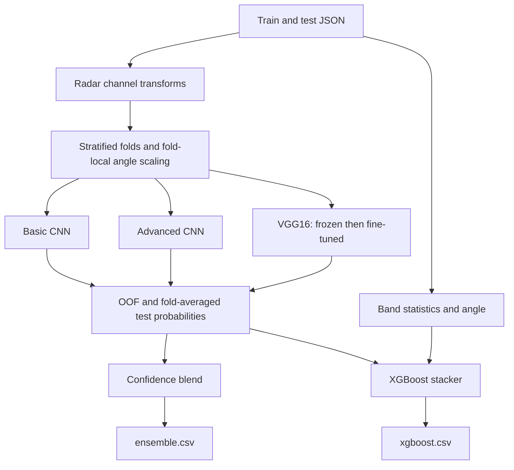

# [Statoil Iceberg Classifier Challenge](https://www.kaggle.com/c/statoil-iceberg-classifier-challenge)

Final rank: not documented / Teams: not documented / Medal: not documented in the portfolio index.

I approached iceberg detection as a combination of radar image classification,
incidence-angle metadata, and statistical image features. This folder preserves
that method: custom CNNs, VGG16 transfer learning, and XGBoost stacking.
It is a runnable reconstruction of the solution, not a claim to reproduce a
verified leaderboard score. Historical predictions and experiment logs are not included.

## Problem

The task was to distinguish icebergs from ships in satellite radar patches.
For each test image, I needed to predict the probability of `is_iceberg`,
with `1` representing an iceberg and `0` a ship.

The metric is binary log loss. Confident mistakes are expensive, so useful
validation probabilities matter more than a hard classification threshold.
Radar texture can be noisy, the labeled set is small, and similar-looking
objects need to be separated without the familiar color cues of photographs.

## Data

The pipeline expects the competition JSON records:

- `id`: the record identifier used to align predictions and submissions.
- `band_1`, `band_2`: flattened radar bands, each reshaped to `75 × 75`.
- `inc_angle`: incidence angle, sometimes represented by the string `"na"`.
- `is_iceberg`: the binary target, present only in training records.

These are radar measurements, not RGB images. I construct three channels
from the two bands before passing them to the neural networks.
The handcrafted feature branch works directly on the original band values.

Missing angles need explicit handling. Constant image channels also need a
safe normalization denominator. I do not assume a class ratio or claim a
verified leakage pattern from the artifacts in this folder.

## Approach

### Validation

I use shuffled, stratified five-fold validation with a fixed seed.
All neural models share the same row splits, producing one out-of-fold (OOF)
probability per training record. Test probabilities are averaged across folds.

In this reconstruction, angle imputation and scaling are fitted only on each
fold's training rows. The same saved statistics transform its validation and
test rows. Missing angles use the training mean; an entirely missing training
angle column and zero-range angles have finite fallbacks.

OOF and test tables are aligned by `id` before blending or stacking.
The printed neural and confidence-blend losses are local validation metrics.
The XGBoost cross-validation step selects a boosting length; because it reuses
existing neural OOF features, it is not an independent nested-CV estimate of
stacking performance.

### Radar preprocessing

I retain both channel recipes from the solution:

- **Source 1:** absolute band difference, elementwise maximum, elementwise minimum.
- **Source 2:** second band, first band, and their arithmetic mean.

Each channel is standardized within its own image. The default neural training
path uses source 1 for all three architectures. Source 2 remains available as
an alternative representation through the component API; preparing it does
not imply that another set of models is trained automatically.



### Neural models

The basic CNN uses six convolution layers, batch normalization, Swish
activations, max pooling, and dropout. Its flattened image representation
is concatenated with a learned scalar representation of the incidence angle.
Dense layers produce a sigmoid probability.

The advanced CNN retains the same image-plus-angle idea with paired
valid-padding convolutions and a different dense head. Its augmentation
includes translations as well as flips, rotations, and zoom.

VGG16 uses an ImageNet-initialized convolutional backbone with global max
pooling and an angle-aware classification head. I first train the head with
the backbone frozen, then unfreeze it at a lower learning rate.
The default learning rates are `1e-4` and `5e-5` respectively.

Training uses Adam and binary cross-entropy. Validation loss controls early
stopping, learning-rate reduction, and best-weight checkpoints. The best
checkpoint is retained across the frozen and fine-tuning stages.
Image augmentation keeps each image paired with its original angle and label.

### Statistical features and stacking

I compute intensity summaries, Laplacian and Sobel variation, skewness,
kurtosis, histograms, and cross-channel interactions. The original selected
feature indices are retained, alongside incidence angle. Non-finite summary
values receive a sentinel so constant patches do not break tree training.

The confidence blend uses the minimum probability when every model predicts
below `0.15`, the maximum when every model predicts above `0.95`, and the mean
otherwise. Probabilities are clipped before writing the blended submission.
These are inherited thresholds; this repository contains no threshold-search
results establishing that they are optimal.

The XGBoost branch combines selected statistical features with neural OOF
scores for training and fold-averaged scores for test prediction. IDs and
labels are explicitly excluded from its feature matrix. The full pipeline
now writes both the confidence blend and the XGBoost submission.

## What mattered most

These are the central design choices I preserved, rather than measured
ablation gains; the original experiment evidence is not available here.

- Compare the radar bands explicitly instead of treating them as natural color.
- Give the models incidence angle alongside the image representation.
- Use stratified OOF predictions to build and inspect the ensemble.
- Regularize the CNNs with augmentation, dropout, and validation checkpoints.
- Combine learned image probabilities with statistical radar summaries.

## Repository layout

```text
statoil/
├── README.md                  # Solution story, limitations, and run instructions
├── requirements.txt           # Direct runtime dependencies
├── .gitignore                 # Local data, checkpoints, caches, and output exclusions
├── main.py                    # Configurable full-pipeline and individual-stage CLI
├── example_usage.py           # Python API examples for full and component runs
├── dry_run.py                 # Synthetic data generation and end-to-end assertions
├── src/
│   ├── __init__.py            # Package marker
│   ├── config.py              # Production defaults and small-run overrides
│   ├── data_utils.py          # Radar transforms, folds, and saved angle statistics
│   ├── feature_engineering.py # Statistical feature extraction and selected CSVs
│   ├── models.py              # CNNs, VGG16, confidence blend, and XGBoost
│   ├── trainer.py             # Augmentation, training stages, and checkpoints
│   ├── predictor.py           # Fold inference, OOF evaluation, and per-model CSVs
│   └── pipeline.py            # Stage orchestration and ID-aligned stacking
├── sample_data/               # Generated synthetic JSON, folds, and feature tables
└── dry_run_output/            # Generated smoke-test weights and submissions
```

## How to run

Use Python 3.11 and install the dependencies from this directory:

```bash
python -m pip install -r requirements.txt
```

Extract the real competition files into this layout:

```text
data/
└── download/
    ├── train.json
    └── test.json
```

Run the complete pipeline:

```bash
python main.py --data-dir data --model-dir models --submission-dir submissions
```

The default VGG16 training run downloads ImageNet weights if they are not
cached. Use `--no-pretrained` for random initialization and `--cpu` to disable
GPU use. This changes initialization, so it is not equivalent to transfer learning.

The CLI also supports `--folds`, `--epochs`, `--batch-size`,
`--steps-per-epoch`, and `--feature-workers`. Use `python main.py --help`
for the complete interface. Individual stages follow this dependency order:

```bash
python main.py --stage prepare
python main.py --stage features
python main.py --stage train
python main.py --stage predict
python main.py --stage ensemble
python main.py --stage xgboost
```

Reuse the same directories and configuration between stages. Preparation
writes transformed arrays and angle statistics under the data directory.
Training writes `.weights.h5` checkpoints under the model directory.
Prediction writes OOF tables under `data/model/` and submission CSVs under
`submissions/`, each with `id,is_iceberg` columns. Full-data training is costly;
use the dry run first to verify the environment.

### Synthetic CPU dry run

```bash
python dry_run.py
```

The script creates competition-shaped JSON under `sample_data/download/`,
including missing angles and constant radar patches. It runs both channel
recipes, statistical feature extraction, both CNNs, frozen and fine-tuned
VGG training, checkpoint reloads, OOF inference, blending, and XGBoost.
It checks submission IDs, columns, finite probabilities, and complete OOF coverage.

For speed, it uses two folds, a single training step per stage, reduced
channel widths, and resized network inputs. Its VGG has the same block
structure with narrower random-initialized layers; no pretrained weights
are downloaded. Production architecture sizes and initialization defaults
remain unchanged. Nothing in the pipeline is skipped, but this is an
execution check, not a performance benchmark or full-scale training test.
Generated inputs and outputs are ignored by the local `.gitignore`.

## Lessons / what I'd do differently

- I would preserve predictions, fold assignments, and ablation logs alongside
  each experiment so historical performance claims remain auditable.
- I would evaluate the stacker with an outer validation split before treating
  its internal cross-validation result as evidence of improvement.
- I would test confidence thresholds and the alternative radar representation
  under the same validation protocol before expanding the ensemble.
