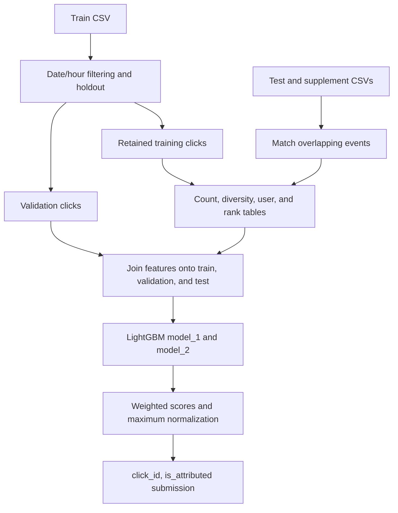

# [TalkingData AdTracking Fraud Detection](https://www.kaggle.com/competitions/talkingdata-adtracking-fraud-detection)

**Final rank: #16 / 3,943 teams · Gold medal**

Ujjwal Singh Rao · Kaggle Master

I approached this as a problem of recovering behavior from anonymous click logs.
The core of my solution is grouped activity features, a date/hour validation
holdout, and a weighted LightGBM ensemble.
This folder contains the runnable, refactored portion of that solution.
The competition placement above comes from the portfolio's root README;
the synthetic example below checks execution, not leaderboard performance.

## Problem

For each mobile advertisement click, I predict whether it leads to an attributed
app download. The target is `is_attributed`, and the evaluation metric is ROC AUC.
Although the competition is framed around fraud detection, a negative target
means no attributed download; it is not a verified fraud label.

The difficult part is separating useful intent from repetitive background
activity. Positive outcomes are rare, categorical identifiers have many possible
values, and the meaning of a click depends on surrounding traffic.
The data also changes over time, so validation design matters as much as model fit.

## Data

The inputs are tabular CSV click logs, with one event per row.

| File / fields | Role |
| --- | --- |
| `train.csv` | Labeled clicks used for fitting and the validation holdout |
| `test.csv` | Clicks requiring predictions, identified by `click_id` |
| `test_supplement.csv` | Additional unlabeled traffic for aggregate features |
| `ip`, `app`, `device`, `os`, `channel` | Integer identifiers describing each click |
| `click_time` | Timestamp used for filtering, validation, and time features |
| `is_attributed` | Binary training label and submission prediction column |
| `attributed_time` | Training-only outcome timestamp; deliberately excluded from inputs |

The loader uses unsigned integer types for identifiers and parses `click_time`.
I keep intermediate tables in Feather format to avoid repeatedly parsing CSVs.

Test and supplement IDs belong to separate namespaces.
The preprocessing step matches events using all click identifiers, the timestamp,
and occurrence order for repeated identical events.
It counts overlapping test events once while retaining additional supplement traffic.
Predictions always retain the official test IDs and their input order.

## Approach

### Validation and preprocessing

I retain rows after `2017-11-08 12:00:00` **or** rows in the selected hours:
`4, 5, 9, 10, 13, 14`.
The validation set contains retained rows after `2017-11-09` in those hours;
all other retained rows form the training set.

This is the date/hour holdout encoded in the recovered solution.
It is not a strictly forward-only split: training can include later events outside
the validation hours. I keep that behavior explicit instead of presenting the
holdout as a general estimate of future production performance.
Both partitions must contain positive and negative labels for AUC evaluation.

I derive `day` and `hour` before building aggregate tables.
`day` participates in aggregate keys but is excluded from model predictors,
along with IDs, raw timestamps, and the target.

### Features: describe the activity around a click

The pipeline builds these feature families:

- **Volume:** counts by IP, app, and OS, plus combinations such as
  IP–day–hour, IP–app, IP–app–OS, IP–device, and app–channel.
- **Local time context:** IP–hour–OS and IP–hour–app counts.
- **User proxies:** counts for IP–device–OS and IP–device–OS–app.
  These are activity groupings, not verified individual users.
- **Diversity:** distinct apps and channels seen for an IP.
- **Frequency ranks:** dense ranks for IP, app–channel, app–OS, and channel–OS.

These tables produce 18 engineered columns alongside the raw categorical inputs
and hour. Joins enforce one aggregate value per key, preventing accidental row
multiplication. Missing counts become zero; missing ranks use the retained
fallback value of `11`.

I build aggregate mappings from retained training clicks and unlabeled
test/supplement traffic. Validation rows and labels do not enter those mappings.
This is a transductive competition workflow: the available test traffic helps
describe activity, without using test outcomes. It is not an online feature service.

A standalone next-click helper computes the time to the following event for an
IP–app–device–OS group. It is exercised by the dry run, but it is not connected to
the default model feature set. Target/running encodings are not implemented here.

### Models and training

I use LightGBM binary classifiers with categorical identifiers passed explicitly
as categorical features. The recovered configurations differ in learning rate,
leaf count, and row subsampling:

| Configuration | Learning rate | Leaves | Row subsample |
| --- | ---: | ---: | ---: |
| `model_1` | 0.075 | 32 | 0.6 |
| `model_2` | 0.1 | 24 | 0.5 |

Both use feature subsampling and `scale_pos_weight=99.7` to emphasize rare
positive outcomes. Training uses validation AUC and early stopping, with a
configurable maximum of 1,000 boosting rounds and patience of 50 rounds.
The random seed and CPU thread count are configurable.
Each booster is saved with feature names so later prediction runs use the same order.

### Ensemble and output

The runnable ensemble contains the two configurations above.
The historical configuration retains six blend weights, but only two model
parameter sets are present; I do not reconstruct the missing models or claim
this folder exactly reproduces the final competition submission.

I combine the available model scores with weights `2.0` and `0.5`.
The retained post-processing divides the weighted sum by its maximum across the
prediction batch. That preserves ranking for AUC, but the resulting values are
not calibrated probabilities and depend on the prediction batch.
All-zero scores remain zero. File-based blending aligns by `click_id` and rejects
missing or duplicate IDs instead of silently dropping rows.



## What mattered most

These are the central ideas preserved in the solution; I do not have a saved
ablation table here to attach score gains to each one.

- I represented repeated activity at several granularities, rather than asking
  trees to infer behavior from isolated identifier values.
- I combined volume with diversity: many clicks and many distinct apps describe
  different patterns of activity.
- I used hour-aware validation to expose temporal differences in traffic.
- I paired class weighting with AUC-based early stopping for the imbalanced target.
- I blended related tree configurations while preserving event identity through
  feature joins and submission assembly.

## Repository layout

```text
talking/
├── README.md                    # Solution write-up and execution guide
├── main.py                      # CLI for full and individual pipeline stages
├── dry_run.py                   # Synthetic CSV generation and end-to-end checks
├── example_usage.py             # Runnable synthetic or real-data API example
├── requirements.txt             # Runtime dependencies
├── setup.py                     # Package metadata and console entry point
├── MANIFEST.in                  # Dependencies and examples in source distributions
├── .gitignore                   # Local generated-data and build exclusions
└── src/
    ├── __init__.py              # Public Config and pipeline exports
    ├── pipeline.py              # Feature joins, training, predictions, blending
    ├── core/
    │   ├── __init__.py          # Configuration export
    │   └── config.py            # Paths, time filters, LightGBM settings, weights
    ├── data/
    │   ├── __init__.py          # Data utility exports
    │   ├── data_utils.py        # Typed loading, splitting, aggregate features
    │   └── preprocessing.py     # Processed tables and supplement event matching
    └── models/
        ├── __init__.py          # Model and trainer exports
        ├── models.py           # LightGBM persistence and ensemble blending
        └── trainer.py          # AUC evaluation, importance, prediction CSVs
```

## How to run

Use Python 3.11 or newer, from this folder:

```bash
python -m pip install -r requirements.txt
python dry_run.py
```

The dry run writes competition-shaped CSVs to `sample_data/` and artifacts to
`dry_run_output/`. It trains both models on CPU with a tiny configuration and
checks preprocessing, every aggregate family, saved-model reloads, validation,
feature ordering, blending, and submission writing. It needs no downloaded model
weights and skips no pipeline stage. `python example_usage.py` runs the same example.

For real data, download the CSVs from the linked Kaggle competition and arrange:

```text
data/download/
├── train.csv
├── test.csv
└── test_supplement.csv
```

```bash
python main.py --mode full --data-dir data --num-threads 4
# Alternatively keep raw CSVs in a separate directory:
python main.py --mode full --data-dir data --raw-data-dir /path/to/csvs
# Separate stages, using the same output directory:
python main.py --mode preprocess --data-dir data
python main.py --mode train --data-dir data
python main.py --mode predict --data-dir data
python main.py --mode evaluate --data-dir data
python main.py --mode submit --data-dir data
```

`--num-boost-round` controls training length; `--skip-preprocess` reuses processed
inputs during a full run. `train` prepares missing intermediate datasets as needed.
Prediction and evaluation reload saved boosters in a fresh process.
The final output is `data/submissions/final_submission.csv` with columns
`click_id,is_attributed`. Intermediate data, feature tables, models, validation
scores, and per-model submissions remain under the selected data directory.

For Python callers, use `Config(data_dir="data", raw_data_dir="/path/to/csvs")`
and `TalkingDataPipeline(config).run_full_pipeline()`.
The real-data path reads CSVs and performs group-bys in memory; it does not
implement streaming. Full competition scale requires capacity planning beyond
what the tiny CPU run verifies.

## Lessons / what I'd do differently

- I would save the exact training snapshot, feature manifest, and all model
  configurations alongside the final submission to make historical reproduction precise.
- I would compare this holdout with a strictly forward validation split and
  separately measure the value of test-context aggregates.
- I would partition large aggregations and benchmark peak memory before scaling
  the pandas implementation to the full dataset.
- For deployment, I would use past-only feature computation and evaluate probability
  calibration instead of retaining batch-dependent maximum normalization.
