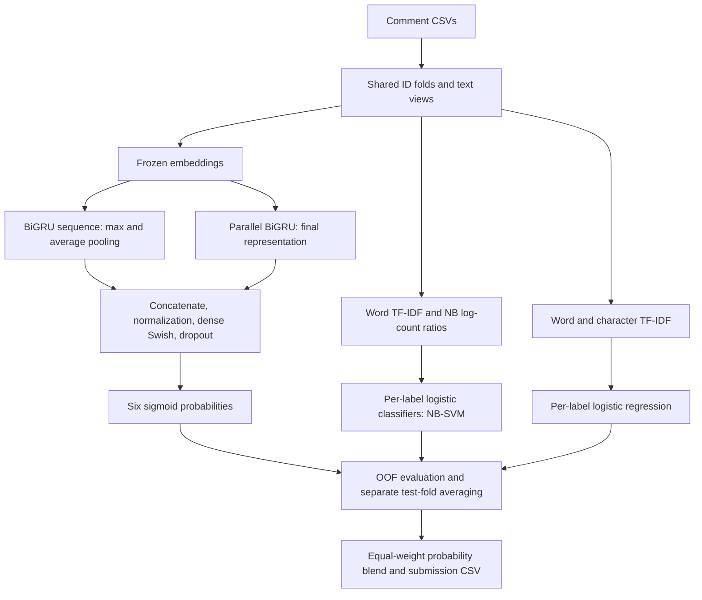

# [Toxic Comment Classification Challenge](https://www.kaggle.com/competitions/jigsaw-toxic-comment-classification-challenge)

**Final rank: #29 / 4,539 teams — Silver medal.**

I’m Ujjwal Singh Rao, a Kaggle Master. My approach combined recurrent text
models with sparse lexical classifiers, then blended their probabilities.
This folder is a runnable reconstruction of the components retained in this
portfolio, with a small offline check of the complete training pipeline.
The rank comes from the [portfolio table](../README.md); the synthetic run does
not reproduce that result.

## Problem

I predicted whether a Wikipedia discussion comment belonged to each of these
six categories: `toxic`, `severe_toxic`, `obscene`, `threat`, `insult`, and
`identity_hate`.
A comment can have several positive labels, or none.

The metric is the mean ROC AUC across the labels.
That makes probability ordering important; moderation thresholds are separate.

The challenge was the variety of language: explicit abuse, misspellings,
capitalization, repeated punctuation, and context-dependent meaning.
Rare labels also make validation less stable than an aggregate score suggests.

## Data

| File | Required columns | Role |
| --- | --- | --- |
| `train.csv` | `id`, `comment_text`, and the six binary targets | Training and validation |
| `test.csv` | `id`, `comment_text` | Unlabeled comments to score |
| `sample_submission.csv` | `id` and the six target columns | Competition submission template; not required by the loader |

IDs are read as strings so leading zeros survive every intermediate CSV.
Text length varies, and comments can contain URLs, IP addresses, user mentions,
emoticons, and wiki-style punctuation.
Labels are imbalanced and overlapping; the pipeline treats them as separate
binary outcomes rather than mutually exclusive classes.

Missing text gets a placeholder during preprocessing; empty comments are also
supported. Missing or nonbinary training labels are rejected.
There are no competition data files or pretrained vectors bundled here.

## Approach

### Validation

I use shuffled KFold splits over comment IDs, with `n_folds=10` and
`random_state=2017` by default. Every preprocessing variant shares those splits.
The retained implementation is ordinary KFold, not multilabel stratification.

Each training row receives one out-of-fold prediction from each model variant.
I concatenate these held-out predictions and restore the original ID order.
For test comments, I average predictions from the fold models.
The final blend is evaluated only against the training labels through its OOF
predictions; test rows never enter that evaluation.

### Preprocessing and features

I kept several views of the same text:

- **Basic clean:** remove URLs and IP addresses, strip punctuation, normalize spaces.
- **Basic clean, lowercase:** apply the same cleaning and lower the text.
- **Marker tokenization:** preserve signals such as all-caps words, emoticons,
  hashtags, elongated words, repeated punctuation, and URLs as explicit tokens.
- **NLTK tokenization:** retain token boundaries after light cleaning; use a
  Treebank fallback if local Punkt resources are unavailable.
- **Preprocessed:** pass supplied text through without additional cleaning.

The default neural run uses the first two configured views.
The sparse models use the `preprocessed` view when available, otherwise the
first configured view. Preparing all variants does not automatically train a
model on each of them.
The lowercasing neural tokenizer makes the two basic views equivalent; I would
change the configured views before treating them as sources of model diversity.

### Recurrent neural model

I use frozen GloVe or FastText embeddings with a bidirectional GRU architecture.
The default input is padded or truncated to 200 tokens, with 300-dimensional
vectors and a vocabulary cap of 30,000.

Two parallel bidirectional GRU branches read the embeddings.
One returns a sequence for max and average pooling; the other returns its final
representation. I concatenate those features before the dense classifier.
This retained model uses pooling rather than an attention layer.
The broader portfolio lists CNN and attention work, but those architectures
are not implemented in this folder.



I train with binary cross-entropy and Adam, using spatial dropout, recurrent
and ordinary dropout, and batch normalization.
The default configuration uses 50 GRU units per direction, dense layers of
256 units, a batch size of 256, and up to 12 epochs.
Early stopping monitors validation loss and restores the best weights.

### Sparse models

**NB-SVM** starts with word unigram and bigram TF-IDF.
For each label I calculate a smoothed positive/negative log-count ratio,
reweight the sparse features, and fit a logistic classifier.
The retained implementation uses logistic probabilities despite the NB-SVM name.

**Logistic regression** combines word unigram TF-IDF with character n-grams
of lengths 2–6. Character features provide another view of spelling variations
and partial words. Defaults cap the word and character vocabularies at
10,000 and 50,000 features respectively.

The original feature-fitting scopes are preserved: the neural tokenizer sees
fold training and validation text; the logistic TF-IDF vocabularies see train,
validation, and test text. NB-SVM fits its vocabulary on fold training text.
The former choices are transductive use of unlabeled text, so this is not a
strictly inductive validation setup.

### Blending and outputs

I average the base-model probabilities with equal weights by default.
Weighted blending and logistic stacking are also available as Python APIs.
Stacking is not enabled in the default run, and its fitted training predictions
must not be reported as an independent validation score.

All blending matches comment IDs explicitly.
A label with only one class in a training fold gets a constant sparse-model
prediction. A single-class evaluation label has undefined AUC, reported as
`NaN`; the overall score also remains undefined in that case.

## What mattered most

These are the main design choices in the retained solution. I do not have
archived ablation runs here to attach measured gains to individual choices.

- I combined sequence representations with lexical models so the blend could
  capture both word order and direct token evidence.
- I used character features alongside words to retain useful spelling fragments.
- I kept alternative cleaning strategies because aggressive normalization can
  remove expressive signals as well as noise.
- I used shared folds and OOF probabilities to compare models on the same rows.
- I treated rare labels separately and inspected per-label AUC rather than
  relying only on the mean.

## Repository layout

```text
toxic/
├── README.md              # Solution narrative and execution guide
├── main.py                # Train/predict, preprocess, and evaluate CLI
├── dry_run.py             # Generate synthetic CSVs and run all model families
├── example_usage.py       # Preprocessing, blending, and synthetic training examples
├── requirements.txt       # Runtime dependencies
├── setup.py               # Package metadata; uses the same dependency list
├── .gitignore             # Excludes data, predictions, logs, and caches
├── src/
│   ├── __init__.py        # Package marker
│   ├── config.py          # Dataclass defaults and JSON configuration loading
│   ├── data_utils.py      # CSV validation, text cleaning, and fold file generation
│   ├── models.py          # BiGRU, NB-SVM, and word/character logistic models
│   ├── ensemble.py        # ID alignment, blending, stacking, and ROC AUC
│   └── pipeline.py        # Fold training, prediction aggregation, and CSV outputs
├── tests/test_pipeline.py # Regression checks for IDs, folds, and sparse classifiers
├── sample_data/           # Generated train/test/template CSVs; ignored
└── dry_run_output/        # Generated config, folds, predictions, and logs; ignored
```

## How to run

Use Python 3.11; install dependencies from this folder:

```bash
python -m pip install -r requirements.txt
```

### Real competition data

```text
data/
├── raw/
│   ├── train.csv
│   ├── test.csv
│   └── sample_submission.csv
└── embeddings/
    ├── glove.840B.300d.txt
    └── fasttext.txt                 # Optional alternative text-format vectors
```

```bash
python main.py --mode train --data-path data/raw --output-path submissions
# Select FastText instead of the default GloVe vectors:
python main.py --models neural --embeddings fasttext --embedding-path data/embeddings/fasttext.txt
# Run the sparse models without loading embeddings or initializing TensorFlow:
python main.py --models traditional --data-path data/raw
```

`--cpu` disables TensorFlow GPU devices. `--config path/to/config.json` accepts
`data`, `model`, and `evaluation` objects using the fields in `src/config.py`.
CLI path options override the corresponding JSON values.
No weights or datasets are downloaded automatically.

Training writes `models/*_validation.csv`, `logs/evaluation.csv`, and
`submissions/*_submission.csv`, including `final_ensemble_submission.csv`.
`--model-path` controls the OOF directory; `--output-path` controls submissions.
These are prediction artifacts, not saved model checkpoints.
The training command includes test prediction; standalone checkpoint inference
is not exposed by this reconstruction.

```bash
python main.py --mode preprocess --data-path data/raw
python main.py --mode evaluate --data-path data/raw --model-path models
```

### Offline dry run
```bash
python dry_run.py
python -m unittest discover -s tests -v
python -m compileall -q .
```

The dry run generates 64 training comments and 8 test comments, exercises all
preprocessing variants, and trains the neural and sparse models across two folds.
It uses a tiny random embedding matrix and one neural epoch on CPU, with no
pretrained downloads. It checks output IDs, column order, finite probabilities,
and the written submission. No pipeline stage is skipped.
Results are under `dry_run_output/`; this checks execution, not leaderboard
performance. `python example_usage.py` also runs these examples.

## Lessons / what I'd do differently

- I would retain fold assignments, OOF files, and experiment manifests alongside
  each competition result so the final blend and its provenance are auditable.
- I would compare multilabel-stratified folds with the retained KFold scheme,
  especially for rare targets, before trusting small changes in mean AUC.
- I would evaluate an inductive vocabulary-fitting setup separately from the
  transductive one and examine false positives on quoted or contextual language.
