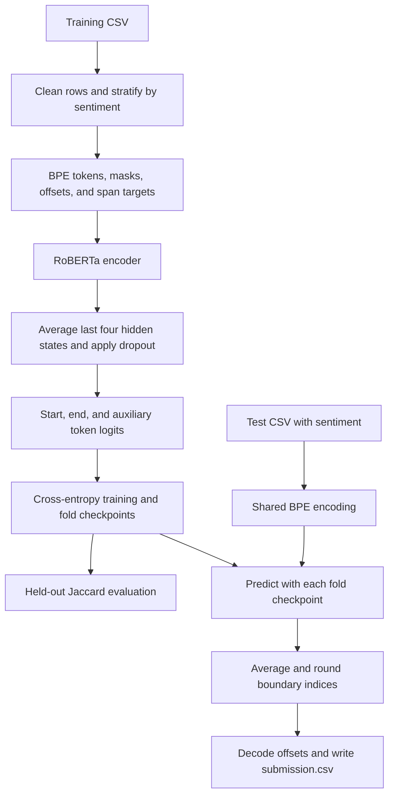

# [Tweet Sentiment Extraction](https://www.kaggle.com/competitions/tweet-sentiment-extraction)

**Final rank: #208 / 2,225 teams · Bronze medal**

I’m Ujjwal Singh Rao, a Kaggle Master. I approached this competition as
sentiment-conditioned span extraction: find the words that explain a supplied
sentiment, using RoBERTa to predict the beginning and end of the answer.
The finish above is recorded in the [portfolio competition table](../README.md).
This folder contains the repaired implementation and an offline CPU example.

## Problem

Given a tweet and a sentiment label, I needed to return the selected portion
of the tweet that best supported that sentiment.
The sentiment itself was an input, not the prediction target.

The competition metric was word-set Jaccard similarity: the intersection of
predicted and annotated words divided by their union, after lowercasing.
Extra words and missing words both hurt the result.

The difficult part was deciding exactly where a sentiment-bearing phrase began
and ended. Short, informal text also makes punctuation, repeated spaces, and
partial-word tokenization consequential for alignment.

## Data

The pipeline consumes CSV files with these columns:

| File | Columns | Role |
| --- | --- | --- |
| `train.csv` | `textID`, `text`, `selected_text`, `sentiment` | Labeled tweets and answer spans |
| `test.csv` | `textID`, `text`, `sentiment` | Unlabeled tweets to extract from |
| `sample_submission.csv` | `textID`, `selected_text` | Competition submission schema |

Sentiment is `positive`, `negative`, or `neutral`.
The model receives a fixed-length token sequence; the default length is 200.
Identifiers remain strings so leading zeros survive CSV loading.

I normalize case and whitespace consistently before locating annotated spans.
Rows without usable training text or annotations are excluded before fold creation.
Test rows are retained, including empty text, to preserve submission alignment.
An annotation that cannot be located raises an explicit error.

The repository does not contain a verified class-count or leakage analysis.
I use sentiment stratification to preserve each fold’s class proportions;
I do not assume that the competition classes are balanced.

## Approach

### Validation

I use shuffled, sentiment-stratified cross-validation with 10 folds and seed 2017.
The preprocessing step writes a `subset` column to `data/processed/train.csv`.
Each model trains on the other folds and is evaluated on its held-out fold.

Training selects checkpoints by validation loss and reports held-out Jaccard
separately. The final console score is the mean of the fold Jaccard scores.
I have not reproduced the leaderboard result with the repaired code;
synthetic scores only verify that the pipeline executes.

### Preprocessing and features

I use RoBERTa’s byte-level BPE vocabulary and merge rules.
The sequence format is:

```text
<s> sentiment </s> </s> normalized_tweet </s> <pad> ...
```

Character offsets connect each tweet token to its span in normalized text.
The annotation becomes a start-token and an end-token target.
Sentiment can occupy multiple tokens, so offsets follow the actual prefix length.
Padding and sentiment-prefix tokens are excluded from answer positions.

Long inputs are truncated to the configured length.
If that would remove part of a training answer, training raises an error with
the tweet ID so I can increase the length instead of training on a false label.
The same encoding and offset logic is used for validation and test inference.

### Model and objective

I fine-tune a pretrained RoBERTa encoder, average its last four hidden states,
apply dropout, and project each token to start, end, and auxiliary logits.
The classifier is deliberately small; the encoder supplies contextual features.

The default objective is the sum of start and end cross-entropy losses.
The source retained an auxiliary Dice loss but did not add it to that objective.
I preserve this behavior: `auxiliary_loss_weight` defaults to zero and can enable
that experimental branch explicitly. I do not claim a measured Dice-loss gain.



### Training and inference

I use AdamW with learning rate `3e-5`, weight decay `0.001`, and no decay on
biases or LayerNorm weights. The default run uses five epochs, dropout `0.5`,
and eight gradient-accumulation steps.
Gradient clipping, ReduceLROnPlateau, and early stopping control training.
The final partial accumulation window is also applied.

CUDA mixed precision is optional; a machine without CUDA falls back to CPU.
The CPU example uses the same encoder class and training loop with random
initialization and a small configuration, without pretrained downloads.

For inference I retain the migrated implementation’s simple ensemble:
average the fold start/end indices independently, then round them.
This is boundary-index averaging, not probability averaging.
I decode the resulting span using the shared offsets; reversed or invalid
boundaries fall back to the full normalized tweet.
Empty tweets produce empty selections. There is no sentiment-specific override.

## What mattered most

These are the central choices in the implementation; the repository does not
provide verified ablations that isolate their leaderboard contributions.

- Conditioning extraction on sentiment makes the supplied label part of the context.
- Character-to-token alignment keeps supervision and decoded answers consistent.
- Averaging the last hidden states combines contextual representations before prediction.
- Stratified held-out folds support validation and provide the models for ensembling.
- Gradient accumulation permits small physical batches during encoder fine-tuning.

## Repository layout

```text
tweet/
├── README.md               # Solution, scope, and execution instructions
├── main.py                 # Train/evaluate/predict CLI with JSON overrides
├── dry_run.py              # Synthetic data, offline CLI run, and regression checks
├── example_usage.py        # Entry point for the same working offline example
├── requirements.txt        # Runtime dependencies
├── setup.py                # Packaging metadata and console entry point
├── .gitignore              # Excludes datasets, checkpoints, and generated outputs
├── src/
│   ├── __init__.py         # Package marker
│   ├── config.py           # Dataclass defaults and JSON configuration loading
│   ├── data_utils.py       # CSV validation, BPE offsets, span labels, and loaders
│   ├── models.py           # RoBERTa feature fusion, token heads, and losses
│   ├── trainer.py          # Optimization, validation, early stopping, checkpoints
│   ├── evaluator.py        # Checkpoint inference, span decoding, and Jaccard
│   └── pipeline.py         # Fold creation, training, evaluation, and ensemble
├── notebook/
│   ├── 00-subset.ipynb     # Empty legacy placeholder; no runnable notebook content
│   ├── 01-train.ipynb      # Empty legacy placeholder
│   ├── 02-score.ipynb      # Empty legacy placeholder
│   └── 03-eval.ipynb       # Empty legacy placeholder
├── sample_data/            # Generated synthetic CSVs and local BPE tokenizer
└── dry_run_output/         # Generated config, processed folds, models, submission
```

## How to run

### Real competition data

Run commands from this folder with Python 3.11 and install the dependencies:

```bash
python -m pip install -r requirements.txt
```

Download the competition CSVs yourself and supply matching pretrained RoBERTa
assets. The default local layout is:

```text
data/raw/train.csv
data/raw/test.csv
data/raw/sample_submission.csv
models/pretrain/vocab.json
models/pretrain/merges.txt
models/pretrain/config.json
models/pretrain/model.safetensors  # or pytorch_model.bin
```

`models/pretrain/` is loaded as a Hugging Face model directory when its config
exists. Otherwise, the encoder uses `model.model_name` (`roberta-base` by default),
which may download weights. The local BPE files must match that encoder.
Checkpoint inference reconstructs the encoder from saved configuration and weights.

```bash
python main.py --mode train --data-path data/raw/train.csv
python main.py --mode evaluate --data-path data/processed/train.csv
python main.py --mode predict --test-path data/raw/test.csv --output-path submissions/
```

Training includes fold creation and held-out evaluation.
Evaluation requires the processed CSV with `subset`, and prediction requires all
fold checkpoints. Use the same tokenizer, sequence length, and fold settings.
The prediction command writes `submissions/submission.csv`.

Use `--config config.json` in every command to override nested `data`, `model`,
and `training` settings. For example:

```json
{
  "data": {"vocab_file": "models/pretrain/vocab.json", "merges_file": "models/pretrain/merges.txt"},
  "model": {"model_name": "models/pretrain"},
  "training": {"device": "cpu"}
}
```

Paths in JSON are relative to the working directory; CLI paths override JSON.
`--device cpu` is also available directly. Full encoder training is intended
for an accelerator; the small example below is the practical CPU smoke test.

### Offline dry run

```bash
python dry_run.py
# Equivalent example entry point:
python example_usage.py
```

The script generates 12 labeled tweets and five test rows under `sample_data/`.
It trains a local BPE tokenizer and a random-init RoBERTa with four layers and
hidden size 32, runs two folds for one epoch each, reloads the checkpoints,
evaluates, ensembles, and writes `dry_run_output/submission.csv`.
Network access is disabled for Hugging Face calls. No pipeline stage is skipped.

Assertions check span alignment, auxiliary-label dimensions, checkpoint updates,
long and empty inputs, leading-zero IDs, and submission order.
Generated scores are smoke-test output, not competition performance estimates.

## Lessons / what I’d do differently

- I would compare probability-level ensembling with the retained boundary-index average.
- I would select and analyze checkpoints by Jaccard as well as token cross-entropy.
- I would preserve original training logs and ablations alongside the code so score claims are auditable.
- I would make offset and unlabeled-inference checks part of every refactor; small data-contract errors can break the entire extraction pipeline.
