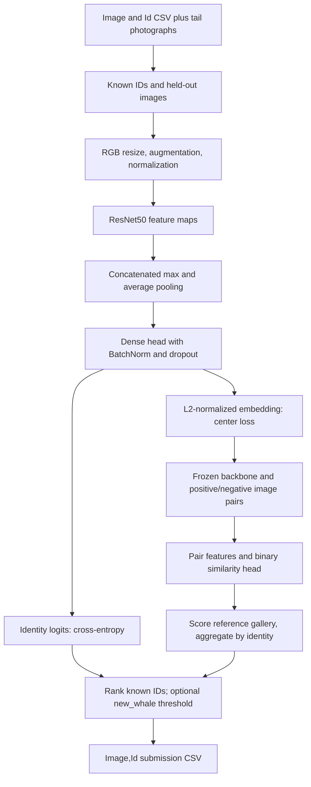

# [Whale Identification Challenge](https://www.kaggle.com/competitions/humpback-whale-identification)

Final rank: not documented / teams: not documented / medal: not documented in the portfolio table.

I approached whale identification as both classification and similarity learning:
learn to recognize known individuals, then learn an embedding and a pairwise comparison.
This folder preserves the ResNet50, center-loss, and Siamese components of that approach.
The runnable reconstruction includes repaired data loading, checkpoint metadata, and inference.

## Problem

The task is to identify an individual humpback whale from a photograph of its tail.
Predictions are ranked whale IDs, with `new_whale` representing an unseen individual.
The metric is **MAP@5**: with one correct identity per image, an earlier correct guess
receives more credit than a later one. See the [competition evaluation and submission format](https://www.kaggle.com/competitions/humpback-whale-identification/overview/abstract).

This is difficult because tails can look similar across individuals, while photographs
of the same individual vary in pose, lighting, background, and crop.
Sparse examples make ordinary multiclass classification a fragile starting point.
The unknown-identity case also requires a decision beyond choosing the largest logit.

The old write-up linked to the later Happywhale whale-and-dolphin competition.
I use the Humpback Whale Identification link here because the retained code uses its
`Image,Id` schema and `new_whale` convention, consistent with the dataset described
in the original write-up. No final score or competition placement is preserved here.

## Data

I use `train.csv` to map image filenames in `train/` to whale IDs.
Test photographs live in `test/`; `sample_submission.csv` provides their output order.
These are image inputs, with no tabular feature branch.
The [competition data page](https://www.kaggle.com/competitions/humpback-whale-identification/data)
describes the image-to-identity mapping and unknown-whale label.

Images can have different dimensions and color modes. The loader converts them to RGB,
resizes them to a square, and produces normalized channel-first tensors.
The production configuration uses an image size of 448 and ImageNet normalization.

The important data quirks are unequal identity frequencies, singleton identities,
and the fact that `new_whale` does not describe one visually coherent individual.
I exclude `new_whale` from known-identity training and keep singleton identities
in the training split. Duplicate filenames are rejected; visual duplicates are not detected.
No supplied data audit establishes a leak or quantifies label noise.

## Approach

### Validation that leaves an identity to learn

I preserve the original split: hold out the first image in CSV order for each identity
with repeated observations, and train on its remaining images.
Singletons stay in training. This is a deterministic known-identity holdout,
not an identity-disjoint test of unseen-whale recognition.

An explicit `--val_csv` can replace that split. Its image names must be disjoint
from `--train_csv`, and its known IDs must occur in the training vocabulary.
The vocabulary is fitted once and stored in every checkpoint.
Classification logs now report MAP@5; checkpoint selection uses validation loss.

### Preprocessing and features

I use horizontal flips, modest affine perturbations, and brightness/contrast changes
on training images. Validation and inference use only resize and normalization.
These transformations encourage tolerance to photographic variation; their effect
on asymmetric tail markings deserves validation rather than assumption.

The CNN supplies the features. Global maximum and average pooling are concatenated,
so the head sees both strong local responses and broader spatial evidence.
There is no separate handcrafted image-feature table.



### Classification and center loss

My default backbone is an ImageNet-initialized ResNet50.
The pooled features feed a 2048-unit head with BatchNorm and dropout,
a classification layer, and an L2-normalized 256-dimensional embedding.
The number of output classes is inferred from the known IDs in the supplied CSV.

Cross-entropy supervises identity logits. In the center-loss variant, I also penalize
the squared distance between an embedding and its learned identity center.
The centers are optimized and saved alongside the network.
This encourages compact identity clusters, while classification separates identities.
The classification-only variant does not directly supervise its embedding projection;
I therefore use the center-loss checkpoint as the default Siamese backbone.

I retain the custom AdamW optimizer and cosine schedule with warm restarts.
The scheduler advances once per epoch. The default backbone freeze setting leaves
its last block trainable; this code does not implement staged unfreezing.
Training batches avoid singleton batches because the dense head uses BatchNorm.

### Optional pseudo-label pretraining

A supplied pseudo-label CSV uses the same `Image,Id` columns and known-ID vocabulary.
If it includes `confidence`, I filter it using the configured threshold.
I pretrain a classifier on these images and then fine-tune that same model on real labels.
Held-out competition filenames are excluded from pseudo-label training.
A separate image directory is supported for external pseudo-labeled images.

The repository consumes pseudo labels; it does not generate them or provide an external dataset.
The basic classifier, pseudo-label model, and center-loss model are separate experiments.
Only pseudo pretraining and its real-label fine-tuning share a continuing optimizer/model.

### Siamese comparison and submission

I freeze the center-loss backbone and train a binary head on same/different-identity pairs.
Its features concatenate both embeddings, their sum, their product, and their absolute difference.
Frozen backbone BatchNorm and dropout stay in evaluation mode during pair training.
Positive training pairs use distinct photographs; negative pairs use different known IDs.
Validation pairs compare held-out anchors against training references.

At inference, the repaired Siamese path caches reference embeddings and scores each query
against the gallery in batches. The maximum reference score for each identity determines
its rank. Pair generation and gallery inference complete previously unfinished paths;
they are not evidence of a recovered historical leaderboard result.

Both inference paths output space-separated whale IDs, without numeric encodings or probabilities.
An optional `--new_whale_threshold` inserts the unknown label at the score cutoff.
It is disabled by default and needs calibration; the known-identity holdout cannot establish
its quality. Classifier probabilities and Siamese scores need separate calibration.
The full-pipeline command writes the center-loss classifier submission.
No ensemble weighting or historical final blend is available in the retained code.

## What mattered most

These are the design priorities visible in my solution, not measured ablation gains:

- Preserve identity information through the split, label encoder, checkpoints, and submission.
- Combine local maximum responses and average-pooled context in the classification head.
- Add an embedding objective before using the network as a frozen similarity backbone.
- Compare different photographs of an identity, rather than learning trivial self-matches.
- Treat unknown-whale handling as a calibration problem separate from known-ID ranking.

## Repository layout

```text
whale/
├── README.md             # Method, limitations, and runnable commands
├── main.py               # Training and prediction CLI
├── example_usage.py      # Python API examples for individual stages
├── dry_run.py            # Offline synthetic pipeline and regression assertions
├── requirements.txt      # Runtime dependencies
├── setup.py              # Package metadata and whale-train console entry point
├── .gitignore            # Generated data, outputs, and Python build artifacts
└── src/
    ├── __init__.py       # Package marker
    ├── config.py         # Paths, model settings, device, and small-run options
    ├── data_utils.py     # Image transforms, vocabulary, splits, and image pairs
    ├── models.py         # ResNet head, center loss, Siamese head, and metrics
    ├── trainer.py        # Training, validation, and self-describing checkpoints
    ├── pipeline.py       # Training stages, gallery scoring, and decoded predictions
    ├── optimizer.py      # Original decoupled-weight-decay AdamW implementation
    └── scheduler.py      # Cosine learning rates with guarded restart periods
```

## How to run

Use Python 3.11 or later from this folder:

```bash
python -m pip install -r requirements.txt
```

Download and extract the competition data yourself into this layout:

```text
data/
├── train.csv              # Image,Id; image names relative to train/
├── sample_submission.csv  # Image,Id; its row order is preserved
├── train/                 # Training JPEGs
├── test/                  # Test JPEGs
└── pseudo_labels.csv      # Optional Image,Id[,confidence]
```

Train the center-loss model and write a submission:

```bash
python main.py --mode train_center_loss --data_dir data \
  --epochs 20 --batch_size 64 --model_dir models
python main.py --mode predict --data_dir data \
  --model_path models/center_loss/model.pth \
  --test_csv data/sample_submission.csv --output_file submission.csv
```

Run all training variants, then predict with the learned pair model if desired:

```bash
python main.py --mode full_pipeline --data_dir data --model_dir models \
  --test_csv data/sample_submission.csv --output_file submission.csv
python main.py --mode predict --model_type siamese --data_dir data \
  --model_path models/siamese/model.pth --output_file siamese_submission.csv
```

`full_pipeline` skips pseudo-label pretraining when its optional CSV is absent.
Use `--pseudo_image_dir` when those images live elsewhere.
Siamese training needs repeated identities remaining after the holdout and distinct identities
for negative pairs. Inference with the pair model requires the labeled training gallery.

Paths are configurable; `--train_csv`, `--val_csv`, and `--test_csv` override CSV locations.
`--device cpu` forces CPU execution; otherwise CUDA is selected when available.
The production default may download ImageNet weights on first training.
`--no_pretrained` disables that download, and checkpoint inference never needs it.
Check `python main.py --help` for all options.

### Offline dry run

```bash
python dry_run.py
# Interpreter used to verify this checkout:
/Users/ujjwal/Downloads/solo/kaggle/.venv/bin/python dry_run.py
```

I generate synthetic JPEGs and competition-shaped CSVs under `sample_data/`.
The smoke configuration uses random-init ResNet18, small heads, 32-pixel inputs,
and one epoch per stage on CPU. ResNet50 remains the production default.
It exercises preprocessing, feature extraction, classification, pseudo-label fine-tuning,
center loss, Siamese training, gallery scoring, checkpoint reloads, and CSV output.
Assertions check finite histories, split separation, MAP calculation, and decoded submission IDs.
Outputs and checkpoints go to `dry_run_output/`; the main result is `submission.csv` there.
No stages are skipped and no pretrained weights or competition data are downloaded.
This checks execution and data contracts, not model quality on whale photographs.

## Lessons / what I'd do differently

- I would add an identity-disjoint validation set and calibrate `new_whale` on unseen identities.
- I would audit visual duplicates and crop quality before interpreting validation improvements.
- I would preserve experiment manifests, ablations, and the final submission blend with the code.
- I would test whether flip augmentation and the current resize preserve useful tail asymmetry.
